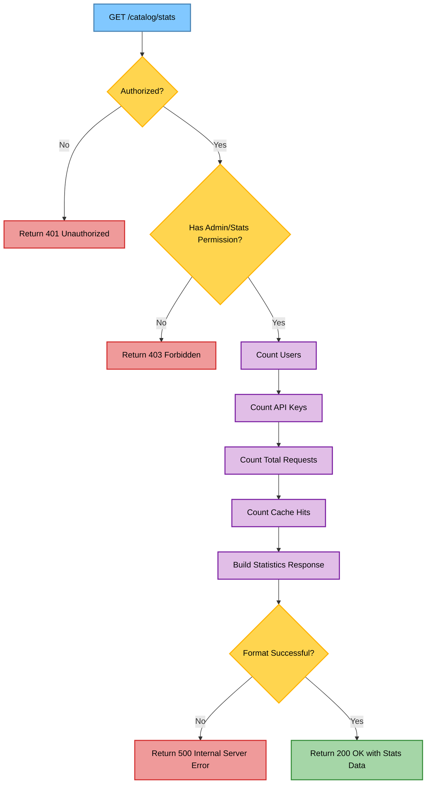
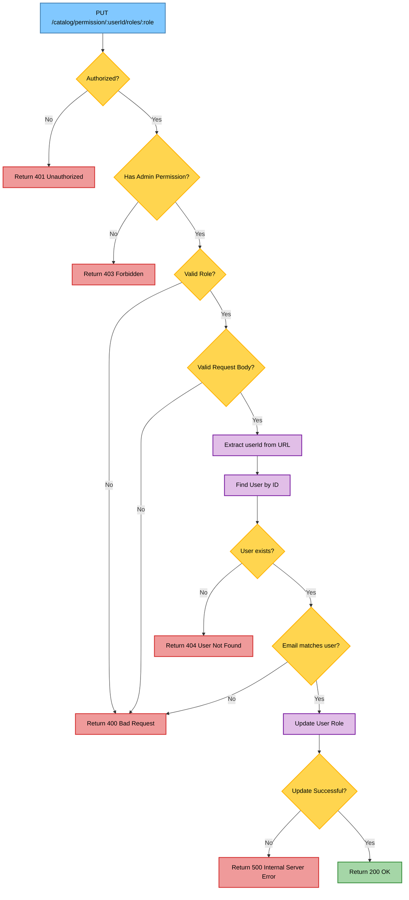
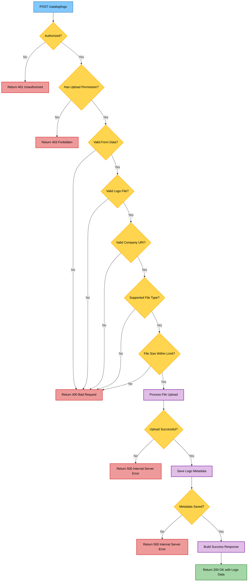
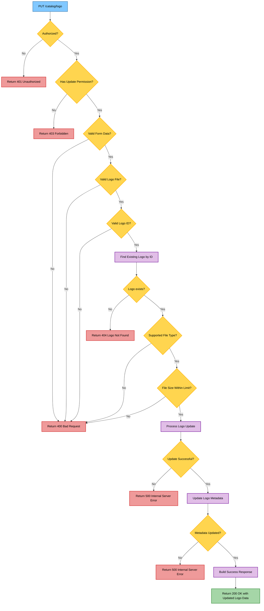
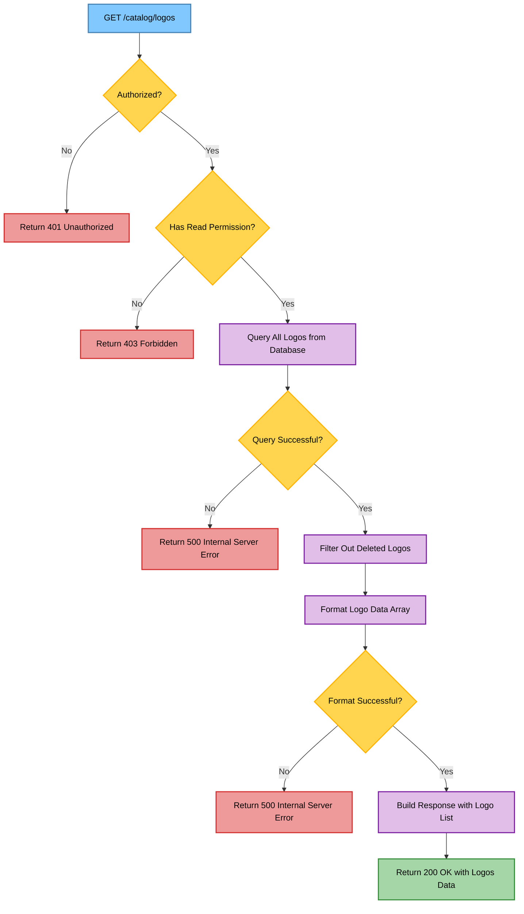

### api flow 1

```mermaid
flowchart TD
%% API Flow: GET /catalog/stats
Start[GET /catalog/stats] --> Auth{Authorized?}
Auth -->|No| Auth401[Return 401 Unauthorized]
Auth -->|Yes| CheckPerms{Has Admin/Stats Permission?}
CheckPerms -->|No| Forbidden403[Return 403 Forbidden]
CheckPerms -->|Yes| GetUsers[Count Users]
GetUsers --> GetKeys[Count API Keys]
GetKeys --> GetRequests[Count Total Requests]
GetRequests --> GetHits[Count Cache Hits]
GetHits --> BuildStats[Build Statistics Response]
BuildStats --> FormatSuccess{Format Successful?}
FormatSuccess -->|No| FormatError500[Return 500 Internal Server Error]
FormatSuccess -->|Yes| Success200[Return 200 OK with Stats Data]

classDef startEnd fill:#81C8FF,stroke:#4682B4,stroke-width:2px,color:#000;
classDef decision fill:#FFD54F,stroke:#FFB300,stroke-width:2px,color:#000;
classDef success fill:#A5D6A7,stroke:#388E3C,stroke-width:2px,color:#000;
classDef error fill:#EF9A9A,stroke:#D32F2F,stroke-width:2px,color:#000;
classDef process fill:#E1BEE7,stroke:#7B1FA2,stroke-width:2px,color:#000;

class Start,Success200 startEnd
class Auth,CheckPerms,FormatSuccess decision
class Success200 success
class Auth401,Forbidden403,FormatError500 error
class GetUsers,GetKeys,GetRequests,GetHits,BuildStats process
```

### api flow 2

```mermaid
flowchart TD
%% API Flow: PUT /catalog/permission/:userId/roles/:role
Start[PUT /catalog/permission/:userId/roles/:role] --> Auth{Authorized?}
Auth -->|No| Auth401[Return 401 Unauthorized]
Auth -->|Yes| CheckPerms{Has Admin Permission?}
CheckPerms -->|No| Forbidden403[Return 403 Forbidden]
CheckPerms -->|Yes| ValidateRole{Valid Role?}
ValidateRole -->|No| BadRequest400[Return 400 Bad Request]
ValidateRole -->|Yes| ValidateBody{Valid Request Body?}
ValidateBody -->|No| BadRequest400
ValidateBody -->|Yes| ExtractUserId[Extract userId from URL]
ExtractUserId --> FindUser[Find User by ID]
FindUser --> UserExists{User exists?}
UserExists -->|No| NotFound404[Return 404 User Not Found]
UserExists -->|Yes| ValidateEmail{Email matches user?}
ValidateEmail -->|No| BadRequest400
ValidateEmail -->|Yes| UpdateRole[Update User Role]
UpdateRole --> UpdateSuccess{Update Successful?}
UpdateSuccess -->|No| UpdateError500[Return 500 Internal Server Error]
UpdateSuccess -->|Yes| Success200[Return 200 OK]

classDef startEnd fill:#81C8FF,stroke:#4682B4,stroke-width:2px,color:#000;
classDef decision fill:#FFD54F,stroke:#FFB300,stroke-width:2px,color:#000;
classDef success fill:#A5D6A7,stroke:#388E3C,stroke-width:2px,color:#000;
classDef error fill:#EF9A9A,stroke:#D32F2F,stroke-width:2px,color:#000;
classDef process fill:#E1BEE7,stroke:#7B1FA2,stroke-width:2px,color:#000;

class Start,Success200 startEnd
class Auth,CheckPerms,ValidateRole,ValidateBody,UserExists,ValidateEmail,UpdateSuccess decision
class Success200 success
class Auth401,Forbidden403,BadRequest400,NotFound404,UpdateError500 error
class ExtractUserId,FindUser,UpdateRole process
```

### api flow 3

```mermaid
flowchart TD
%% API Flow: POST /catalog/logo
Start[POST /catalog/logo] --> Auth{Authorized?}
Auth -->|No| Auth401[Return 401 Unauthorized]
Auth -->|Yes| CheckPerms{Has Upload Permission?}
CheckPerms -->|No| Forbidden403[Return 403 Forbidden]
CheckPerms -->|Yes| ValidateFormData{Valid Form Data?}
ValidateFormData -->|No| BadRequest400[Return 400 Bad Request]
ValidateFormData -->|Yes| ValidateFile{Valid Logo File?}
ValidateFile -->|No| BadRequest400
ValidateFile -->|Yes| ValidateUri{Valid Company URI?}
ValidateUri -->|No| BadRequest400
ValidateUri -->|Yes| CheckFileType{Supported File Type?}
CheckFileType -->|No| BadRequest400
CheckFileType -->|Yes| CheckFileSize{File Size Within Limit?}
CheckFileSize -->|No| BadRequest400
CheckFileSize -->|Yes| ProcessUpload[Process File Upload]
ProcessUpload --> UploadSuccess{Upload Successful?}
UploadSuccess -->|No| UploadError500[Return 500 Internal Server Error]
UploadSuccess -->|Yes| SaveMetadata[Save Logo Metadata]
SaveMetadata --> MetadataSuccess{Metadata Saved?}
MetadataSuccess -->|No| MetadataError500[Return 500 Internal Server Error]
MetadataSuccess -->|Yes| BuildResponse[Build Success Response]
BuildResponse --> Success200[Return 200 OK with Logo Data]

classDef startEnd fill:#81C8FF,stroke:#4682B4,stroke-width:2px,color:#000;
classDef decision fill:#FFD54F,stroke:#FFB300,stroke-width:2px,color:#000;
classDef success fill:#A5D6A7,stroke:#388E3C,stroke-width:2px,color:#000;
classDef error fill:#EF9A9A,stroke:#D32F2F,stroke-width:2px,color:#000;
classDef process fill:#E1BEE7,stroke:#7B1FA2,stroke-width:2px,color:#000;

class Start,Success200 startEnd
class Auth,CheckPerms,ValidateFormData,ValidateFile,ValidateUri,CheckFileType,CheckFileSize,UploadSuccess,MetadataSuccess decision
class Success200 success
class Auth401,Forbidden403,BadRequest400,UploadError500,MetadataError500 error
class ProcessUpload,SaveMetadata,BuildResponse process
```

### api flow 4

```mermaid
flowchart TD
%% API Flow: PUT /catalog/logo
Start[PUT /catalog/logo] --> Auth{Authorized?}
Auth -->|No| Auth401[Return 401 Unauthorized]
Auth -->|Yes| CheckPerms{Has Update Permission?}
CheckPerms -->|No| Forbidden403[Return 403 Forbidden]
CheckPerms -->|Yes| ValidateFormData{Valid Form Data?}
ValidateFormData -->|No| BadRequest400[Return 400 Bad Request]
ValidateFormData -->|Yes| ValidateFile{Valid Logo File?}
ValidateFile -->|No| BadRequest400
ValidateFile -->|Yes| ValidateId{Valid Logo ID?}
ValidateId -->|No| BadRequest400
ValidateId -->|Yes| FindLogo[Find Existing Logo by ID]
FindLogo --> LogoExists{Logo exists?}
LogoExists -->|No| NotFound404[Return 404 Logo Not Found]
LogoExists -->|Yes| CheckFileType{Supported File Type?}
CheckFileType -->|No| BadRequest400
CheckFileType -->|Yes| CheckFileSize{File Size Within Limit?}
CheckFileSize -->|No| BadRequest400
CheckFileSize -->|Yes| ProcessUpdate[Process Logo Update]
ProcessUpdate --> UpdateSuccess{Update Successful?}
UpdateSuccess -->|No| UpdateError500[Return 500 Internal Server Error]
UpdateSuccess -->|Yes| UpdateMetadata[Update Logo Metadata]
UpdateMetadata --> MetadataSuccess{Metadata Updated?}
MetadataSuccess -->|No| MetadataError500[Return 500 Internal Server Error]
MetadataSuccess -->|Yes| BuildResponse[Build Success Response]
BuildResponse --> Success200[Return 200 OK with Updated Logo Data]

classDef startEnd fill:#81C8FF,stroke:#4682B4,stroke-width:2px,color:#000;
classDef decision fill:#FFD54F,stroke:#FFB300,stroke-width:2px,color:#000;
classDef success fill:#A5D6A7,stroke:#388E3C,stroke-width:2px,color:#000;
classDef error fill:#EF9A9A,stroke:#D32F2F,stroke-width:2px,color:#000;
classDef process fill:#E1BEE7,stroke:#7B1FA2,stroke-width:2px,color:#000;

class Start,Success200 startEnd
class Auth,CheckPerms,ValidateFormData,ValidateFile,ValidateId,LogoExists,CheckFileType,CheckFileSize,UpdateSuccess,MetadataSuccess decision
class Success200 success
class Auth401,Forbidden403,BadRequest400,NotFound404,UpdateError500,MetadataError500 error
class FindLogo,ProcessUpdate,UpdateMetadata,BuildResponse process

```

### api flow diagram 5

```mermaid
flowchart TD
%% API Flow: GET /catalog/logos
Start[GET /catalog/logos] --> Auth{Authorized?}
Auth -->|No| Auth401[Return 401 Unauthorized]
Auth -->|Yes| CheckPerms{Has Read Permission?}
CheckPerms -->|No| Forbidden403[Return 403 Forbidden]
CheckPerms -->|Yes| QueryLogos[Query All Logos from Database]
QueryLogos --> QuerySuccess{Query Successful?}
QuerySuccess -->|No| QueryError500[Return 500 Internal Server Error]
QuerySuccess -->|Yes| FilterDeleted[Filter Out Deleted Logos]
FilterDeleted --> FormatData[Format Logo Data Array]
FormatData --> FormatSuccess{Format Successful?}
FormatSuccess -->|No| FormatError500[Return 500 Internal Server Error]
FormatSuccess -->|Yes| BuildResponse[Build Response with Logo List]
BuildResponse --> Success200[Return 200 OK with Logos Data]

classDef startEnd fill:#81C8FF,stroke:#4682B4,stroke-width:2px,color:#000;
classDef decision fill:#FFD54F,stroke:#FFB300,stroke-width:2px,color:#000;
classDef success fill:#A5D6A7,stroke:#388E3C,stroke-width:2px,color:#000;
classDef error fill:#EF9A9A,stroke:#D32F2F,stroke-width:2px,color:#000;
classDef process fill:#E1BEE7,stroke:#7B1FA2,stroke-width:2px,color:#000;

class Start,Success200 startEnd
class Auth,CheckPerms,QuerySuccess,FormatSuccess decision
class Success200 success
class Auth401,Forbidden403,QueryError500,FormatError500 error
class QueryLogos,FilterDeleted,FormatData,BuildResponse process
```
