<details>
<summary>ADMIN</summary>

| URL | Method | Auth Required | Description |
|-----|--------|---------------|-------------|
| `/catalog/stats` | GET | True | Get the user statistics |

> <details>
> <summary>Response body</summary>
>
> ```json
> {
>   "statusCode": 200,
>   "data": {
>     "Users": 10,
>     "Keys": 2,
>     "Requests": 0,
>     "Hits": 0
>   }
> }
> ```
>
> **Response:** `200 OK` - Statistics retrieved successfully</br>
> **Response:** `401 Unauthorized` - Not authenticated</br>
> **Response:** `403 Forbidden` - Not authorized
> </details>
<details>
<summary>Api flow diagram</summary>

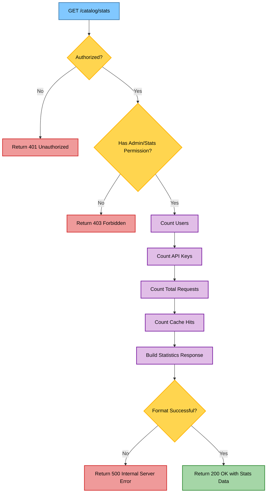
</details>

---
| URL | Method | Auth Required | Description |
|-----|--------|---------------|-------------|
| `/catalog/permission/:userId/roles/:role` | PUT | True | Assign or modify user roles |
 <details>
 <summary>Request body</summary>

 ```json
 {
   "email": "email@user.com"
 }
 ```

 </details>
 <details>
 <summary>Response body</summary>

 ```json
 {
   "statusCode": 200
 }
 ```

 **Response:** `200 OK` - Role updated successfully</br>
 **Response:** `400 Bad Request` - Invalid role</br>
 **Response:** `401 Unauthorized` - Not authenticated</br>
 **Response:** `403 Forbidden` - Not authorized</br>
 **Response:** `404 Not Found` - User not found
 </details>
<details>
<summary>Api flow diagram </summary>

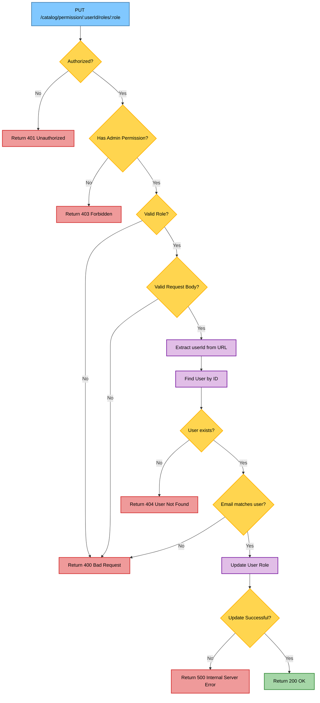
</details>
---
| URL | Method | Auth Required | Description |
|-----|--------|---------------|-------------|
| `/catalog/logo` | POST | True | Upload a new company logo |

> <details>
> <summary>Request body</summary>
>
> ```
> Form Data:
>   logo: File - The logo file to upload
>   companyUri: string - The company URL
> ```
> </details>
>
> <details>
> <summary>Response body</summary>
>
> ```json
> {
>   "statusCode": 200,
>   "message": "Image updated successfully.",
>   "data": {
>     "_id": "image_id",
>     "updatedAt": "timestamp"
>   }
> }
> ```
>
> **Response:** `200 OK` - Logo uploaded successfully </br>
> **Response:** `400 Bad Request` - Invalid input data</br>
> **Response:** `401 Unauthorized` - Not authenticated</br>
> **Response:** `403 Forbidden` - Not authorized
> </details>
<details>
<summary>Api flow diagram </summary>

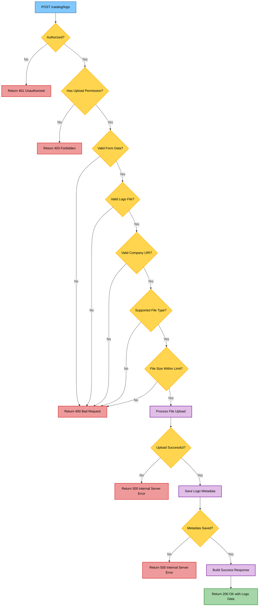
</details>

---
| URL | Method | Auth Required | Description |
|-----|--------|---------------|-------------|
| `/catalog/logo` | PUT | True | Update an existing logo |

> <details>
> <summary>Request body</summary>
>
> ```
> Form Data:
>   logo: File  - The logo file to upload
>   id: string  - The ID of the logo to update
> ```
> </details>
>
> <details>
> <summary>Response body</summary>
>
> ```json
> {
>   "statusCode": 200,
>   "message": "Image updated successfully.",
>   "data": {
>     "_id": "image_id",
>     "updatedAt": "timestamp"
>   }
> }
> ```
>
> **Response:** `200 OK` - Logo updated successfully</br>
> **Response:** `400 Bad Request` - Invalid input data</br>
> **Response:** `401 Unauthorized` - Not authenticated</br>
> **Response:** `403 Forbidden` - Not authorized</br>
> **Response:** `404 Not Found` - Logo not found
> </details>
<details>
<summary>Api flow diagram </summary>

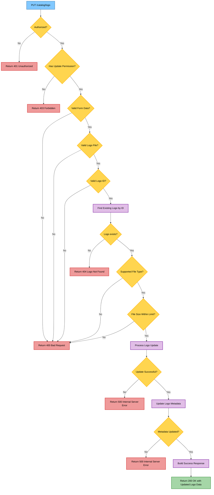
</details>

---
| URL | Method | Auth Required | Description |
|-----|--------|---------------|-------------|
| `/catalog/logos` | GET | True | Retrieve a list of all uploaded logos |

> <details>
> <summary>Response body</summary>
>
> ```json
> {
>   "statusCode": 200,
>   "data": [
>     {
>       "_id": "image_id",
>       "user_id": "user_id",
>       "company_name": "COMPANY.png",
>       "company_uri": "https://company.com",
>       "image_size": 1024,
>       "is_deleted": false,
>       "updated_at": "timestamp"
>     }
>   ]
> }
> ```
>
> **Response:** `200 OK` - Logos retrieved successfully</br>
> **Response:** `401 Unauthorized` - Not authenticated</br>
> **Response:** `403 Forbidden` - Not authorized
> </details>
<details>
<summary> Api flow diagram</summary>

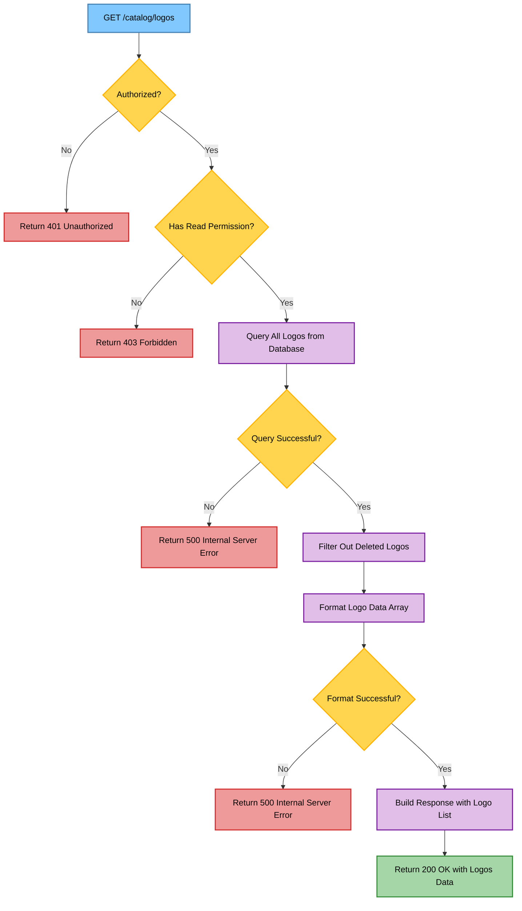
</details>
</details>


<details>
<summary>OPERATOR</summary>

| URL | Method | Auth Required | Description |
|-----|--------|---------------|-------------|
| `/messages/:messageId` | PUT | True | Respond to a contact form message |

> <details>
> <summary>Request body</summary>
>
> ```json
> {
>   "reply": "This is a detailed response to the customer's inquiry."
> }
> ```
> </details>
>
> <details>
> <summary>Response body</summary>
>
> ```json
> {
>   "message": "Message updated successfully",
>   "data": {
>     "reply": "This is a detailed response to the customer's inquiry",
>     "activityStatus": true,
>     "assignedTo": "operator_id",
>     "email": "customer@example.com",
>     "message": "Original customer message"
>   }
> }
> ```
>
> **Response:** `200 OK` - Message updated successfully</br>
> **Response:** `400 Bad Request` - Invalid input data</br>
> **Response:** `401 Unauthorized` - Not authenticated</br>
> **Response:** `403 Forbidden` - Not authorized</br>
> **Response:** `404 Not Found` - Message not found
> </details>


<details>
<summary>Api Flow diagram</summary>

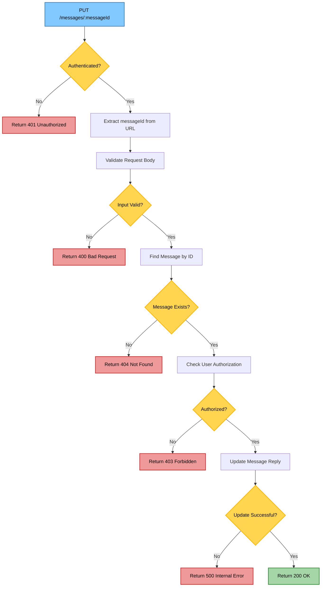
</details>

---
| URL | Method | Auth Required | Description |
|-----|--------|---------------|-------------|
| `/messages` | GET | True | Get messages received from contact form |

> <details>
> <summary>Query parameters</summary>
>
> - `page`: Page number for pagination (optional)
> - `limit`: Number of items per page (optional)
> </details>
>
> <details>
> <summary>Response body</summary>
>
> ```json
> {
>   "message": "Fetched all contact us messages.",
>   "statusCode": 200,
>   "total": 10,
>   "currentPage": 1,
>   "totalPages": 1,
>   "results": [
>     {
>       "_id": "message_id",
>       "email": "customer@example.com",
>       "name": "customer name",
>       "message": "Customer inquiry message",
>       "status": "PENDING",
>       "operator": "operator_id",
>       "is_deleted": false,
>       "updated_at": "timestamp",
>       "comment": "Operator's response"
>     }
>   ]
> }
> ```
>
> **Response:** `200 OK` - Messages retrieved successfully</br>
> **Response:** `400 Bad Request` - Invalid pagination parameters</br>
> **Response:** `401 Unauthorized` - Not authenticated</br>
> **Response:** `403 Forbidden` - Not authorized
> </details>

<details>
<summary>Api Flow diagram </summary>

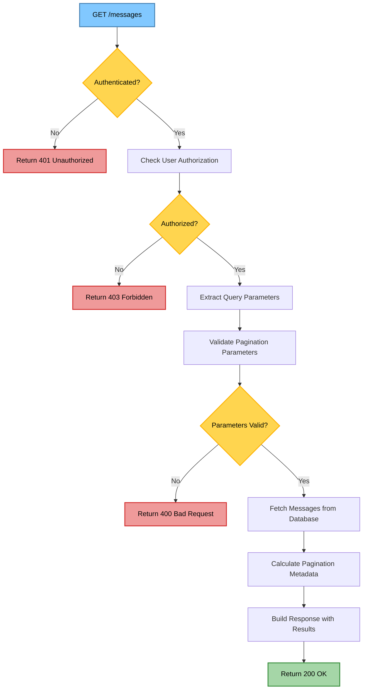
</details>

---
| URL | Method | Auth Required | Description |
|-----|--------|---------------|-------------|
| `/messages/contact-us` | POST | False | Submit a new contact form message |

> <details>
> <summary>Request body</summary>
>
> ```json
> {
>   "name": "customer name",
>   "email": "customer@example.com",
>   "message": "This is a detailed message from the customer."
> }
> ```
> </details>
>
> <details>
> <summary>Response body</summary>
>
> ```json
> {
>   "message": "Form submitted, our team will get in touch shortly",
>   "statusCode": 200
> }
> ```
>
> **Response:** `200 OK` - Message submitted successfully</br>
> **Response:** `400 Bad Request` - Invalid input data
> </details>

<details>
<summary>Api Flow diagram </summary>

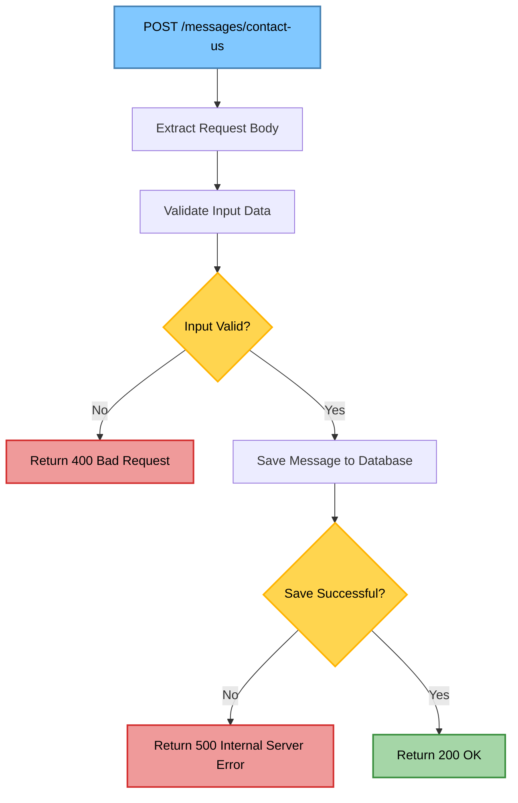

</details>
</details>

<details>
<summary>BUSINESS API</summary>

| URL | Method | Auth Required | Description |
|-----|--------|---------------|-------------|
| `/logo` | GET | False | Get single image |

> <details>
> <summary>Query parameters</summary>
>
> - `domain`: The domain name of the company (required)
> - `API_KEY`: API key for authentication (required)
> </details>
>
> <details>
> <summary>Response body</summary>
>
> ```json
> {
>   "statusCode" : 200,
>   "data": "https://api.example.com/logos/company-logo.png"
> }
> ```
>
> **Response:** `200 OK` - Logo retrieved successfully</br>
> **Response:** `400 Bad Request` - Invalid input parameters</br>
> **Response:** `401 Unauthorized` - Invalid API key</br>
> **Response:** `404 Not Found` - Logo not found
> </details>
<details>
<summary>Api Flow diagram</summary>

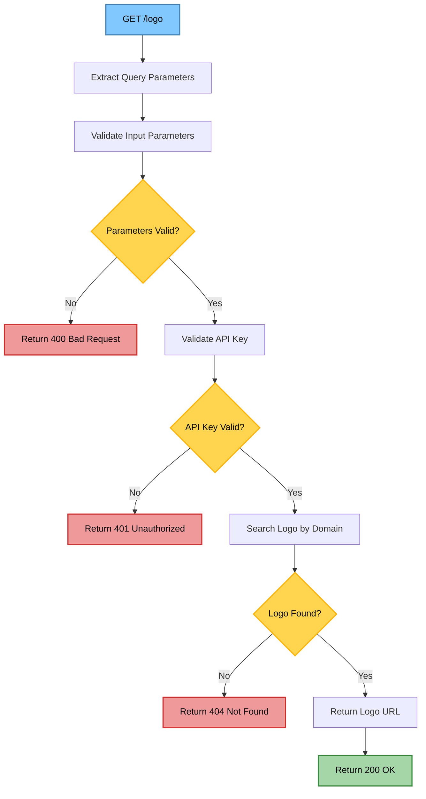
</details>

---
| URL | Method | Auth Required | Description |
|-----|--------|---------------|-------------|
| `/logo/search` | GET | False | Get multiple images |

> <details>
> <summary>Query parameters</summary>
>
> - `domainKey`: Prefix of the domain name to filter logos (required)
> - `API_KEY`: API key for authentication (required)
> </details>
>
> <details>
> <summary>Response body</summary>
>
> ```json
> {
>   "statusCode" : 200,
>   "data": [
>       {
>        "companyName" : "companyName",
>        "image" : "https://api.example.com/logos/company-logo.png"
>       }
>    ]
> }
> ```
>
> **Response:** `200 OK` - Logos retrieved successfully</br>
> **Response:** `400 Bad Request` - Invalid input parameters</br>
> **Response:** `401 Unauthorized` - Invalid API key
> </details>
<details>
<summary>Api Flow diagram</summary>

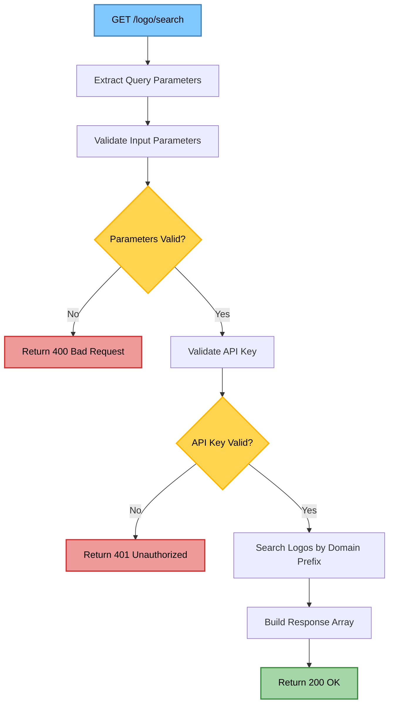
</details>

---
| URL | Method | Auth Required | Description |
|-----|--------|---------------|-------------|
| `/logo/demo-search` | GET | False | Demo search endpoint (no auth required) |

> <details>
> <summary>Query parameters</summary>
>
> - `domainKey`: Prefix of the domain name to filter logos (required)
> </details>
>
> <details>
> <summary>Response body</summary>
>
> ```json
> {
>   "statusCode" : 200,
>   "data": [
>       {
>        "companyName" : "companyName",
>        "image" : "https://api.example.com/logos/company-logo.png"
>       }
>    ]
> }
> ```
>
> **Response:** `200 OK` - Logos retrieved successfully</br>
> **Response:** `400 Bad Request` - Invalid input parameters
> </details>
<details>
<summary>Api Flow diagram</summary>

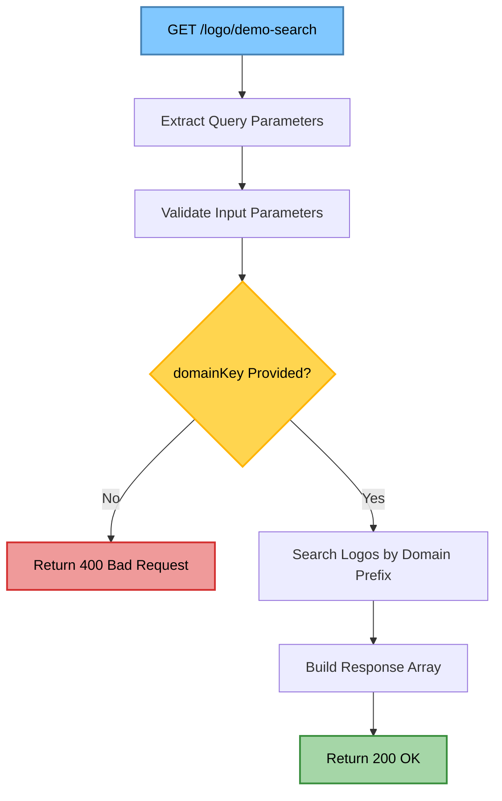
</details>

</details>
