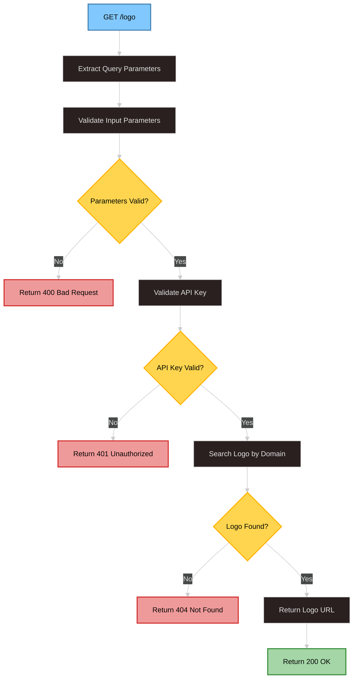
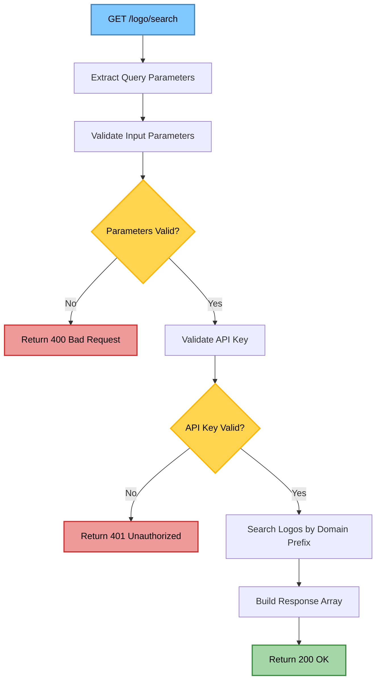
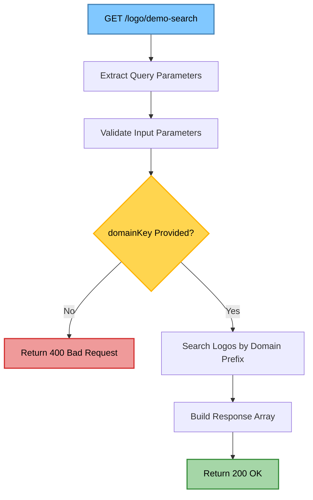

### API FLOW 1

```mermaid
---
config:
  theme: neo-dark
  look: classic
  layout: dagre
---
flowchart TD
%% API Flow: GET /logo
Start[GET /logo] --> ExtractQuery[Extract Query Parameters]
ExtractQuery --> ValidateParams[Validate Input Parameters]
ValidateParams --> ParamsValid{Parameters Valid?}
ParamsValid -->|No| Params400[Return 400 Bad Request]
ParamsValid -->|Yes| ValidateKey[Validate API Key]
ValidateKey --> KeyValid{API Key Valid?}
KeyValid -->|No| Key401[Return 401 Unauthorized]
KeyValid -->|Yes| SearchLogo[Search Logo by Domain]
SearchLogo --> LogoFound{Logo Found?}
LogoFound -->|No| Logo404[Return 404 Not Found]
LogoFound -->|Yes| ReturnUrl[Return Logo URL]
ReturnUrl --> Success200[Return 200 OK]

classDef startEnd fill:#81C8FF,stroke:#4682B4,stroke-width:2px,color:#000;
classDef decision fill:#FFD54F,stroke:#FFB300,stroke-width:2px,color:#000;
classDef success fill:#A5D6A7,stroke:#388E3C,stroke-width:2px,color:#000;
classDef error fill:#EF9A9A,stroke:#D32F2F,stroke-width:2px,color:#000;

class Start,Success200 startEnd
class ParamsValid,KeyValid,LogoFound decision
class Success200 success
class Params400,Key401,Logo404 error


```

### API FLOW 2

```mermaid
flowchart TD
%% API Flow: GET /logo/search
Start[GET /logo/search] --> ExtractParams[Extract Query Parameters]

ExtractParams --> ValidateParams[Validate Input Parameters]
ValidateParams --> ParamsValid{Parameters Valid?}

ParamsValid -->|No| BadRequest400[Return 400 Bad Request]
ParamsValid -->|Yes| ValidateAPIKey[Validate API Key]

ValidateAPIKey --> APIKeyValid{API Key Valid?}
APIKeyValid -->|No| Auth401[Return 401 Unauthorized]
APIKeyValid -->|Yes| SearchLogos[Search Logos by Domain Prefix]

SearchLogos --> BuildResponse[Build Response Array]
BuildResponse --> Success200[Return 200 OK]

classDef startEnd fill:#81C8FF,stroke:#4682B4,stroke-width:2px,color:#000;
classDef decision fill:#FFD54F,stroke:#FFB300,stroke-width:2px,color:#000;
classDef success fill:#A5D6A7,stroke:#388E3C,stroke-width:2px,color:#000;
classDef error fill:#EF9A9A,stroke:#D32F2F,stroke-width:2px,color:#000;

class Start,Success200 startEnd
class ParamsValid,APIKeyValid decision
class Auth401,BadRequest400 error
class Success200 success
```

### API FLOW 3

```mermaid
flowchart TD
%% API Flow: GET /logo/demo-search
Start[GET /logo/demo-search] --> ExtractParams[Extract Query Parameters]

ExtractParams --> ValidateParams[Validate Input Parameters]
ValidateParams --> ParamsValid{domainKey Provided?}

ParamsValid -->|No| BadRequest400[Return 400 Bad Request]
ParamsValid -->|Yes| SearchLogos[Search Logos by Domain Prefix]

SearchLogos --> BuildResponse[Build Response Array]
BuildResponse --> Success200[Return 200 OK]

classDef startEnd fill:#81C8FF,stroke:#4682B4,stroke-width:2px,color:#000;
classDef decision fill:#FFD54F,stroke:#FFB300,stroke-width:2px,color:#000;
classDef success fill:#A5D6A7,stroke:#388E3C,stroke-width:2px,color:#000;
classDef error fill:#EF9A9A,stroke:#D32F2F,stroke-width:2px,color:#000;

class Start,Success200 startEnd
class ParamsValid decision
class BadRequest400 error
class Success200 success


```