## Index

- [Prerequisites](#prerequisites)
- [Clone and run the project locally](#clone-and-run-the-project-locally)
- [Environment variables](#environment-variables)
- [Running latest code using docker](#running-latest-code-using-docker)
- [Running with Docker Compose (including MongoDB)](#running-with-docker-compose-including-mongodb)
- [Postman API Collection](#postman-api-collection)
- [Collections Uses](#collections-uses)
- [API Endpoints Documentation](#api-endpoints-documentation)

## Prerequisites
- Node.js (version 18 or higher recommended, 20+ supported)
- pnpm (package manager). Install globally with `npm install -g pnpm`
- MongoDB
- AWS Account

### Clone and run the project locally
   ```
   git clone https://github.com/TeamShiksha/openlogo.git
   cd openlogo
   pnpm install
   pnpm start
   ```

## Environment variables

Most of the environment variables can be used by copying them from the `.env.example` file. However, if you are trying to run the business APIs locally, you will need some additional environment variables associated with AWS.

- Create a stack using `cloudformation_dev_test.yml` file given inside `app/aws` directory.
- You can generate the private and public RSA key by following the instructions given [here](https://docs.aws.amazon.com/AmazonCloudFront/latest/DeveloperGuide/private-content-trusted-signers.html).
- After the stack creation is successful you can find most environmental variables under the `Output` section which are mentioned below:
   - `BUCKET_NAME`
   - `BUCKET_REGION`
   - `BUCKET_KEY`
   - `DISTRIBUTION_DOMAIN`
   - `CLOUD_FRONT_KEYPAIR_ID`
   - `ACCESS_KEY`
   - `SECRET_ACCESS_KEY`

    **NOTE**: These values will be comma seperated.

## Running latest code using docker

On every merge we pushed the latest code to docker hub.
- [Stage](https://hub.docker.com/u/aps08dev)
- [Prod](https://hub.docker.com/u/aps08)

This is to allow users run the latest code quickly just by supplying the environment variables from `.env` file. You can run the latest published frontend and backend Docker images with your own environment variables:
- Pull the images
```sh
docker pull aps08dev/openlogo-backend:latest
docker pull aps08dev/openlogo-frontend:latest
```
- Run the backend container (port 5000)
```sh
docker run --env-file .env -p 5000:5000 aps08dev/openlogo-backend:latest
```
- Run the frontend container (port 3000)
```sh
docker run --env-file ./frontend.env -p 3000:3000 aps08dev/openlogo-frontend:latest
```
Make sure your .env files contain all required environment variables for each service and the `.env` is in the current directory.

## Running with Docker Compose (including MongoDB)

For local development, you can use Docker Compose to run the backend, frontend, and MongoDB together. `docker-compose.yml` is provided in the repository.

This will start:
- MongoDB (default port 27017)
- Backend (default port 5000)
- Frontend (default port 3000)

You can customize ports and environment variables in the `docker-compose.yml` and `.env` files as needed.

To stop the services, press `Ctrl+C` and run:
```sh
docker compose down
```

## Postman API Collection

The Postman API collection and environment files are located in the ```/docs/Postman Collection``` directory. These files can be used to test the API endpoints:

```postman_collection.json```: Contains the collection of API requests for testing the Openlogo application.

```postman_environment.json```: Contains environment variables for configuring the API requests, such as base URLs and authentication tokens.

To use the Postman collection:

- Import ```postman_collection.json``` into Postman.
- Import ```postman_environment.json``` into Postman.
- Configure the environment variables in Postman from the ```.env``` file.
- Use the collection to test the API endpoints.

## Collections Uses

<details>
  <summary><strong>CONTACTUS</strong> – Stores user inquiries and support requests</summary>
  <table>
    <thead>
      <tr><th>Field</th><th>Type</th><th>Description</th></tr>
    </thead>
    <tbody>
      <tr><td>email</td><td>string</td><td>User's email address (required)</td></tr>
      <tr><td>name</td><td>string</td><td>Name of the user (required)</td></tr>
      <tr><td>message</td><td>string</td><td>Message or inquiry submitted by user (required)</td></tr>
      <tr><td>status</td><td>string (enum)</td><td>Status of the inquiry (e.g. PENDING)</td></tr>
      <tr><td>operator</td><td>ObjectId (ref: users)</td><td>Support operator assigned to handle the inquiry</td></tr>
      <tr><td>is_deleted</td><td>boolean</td><td>Soft delete flag</td></tr>
      <tr><td>openedAt</td><td>date</td><td>Timestamp when inquiry was opened</td></tr>
      <tr><td>closedAt</td><td>date (nullable)</td><td>Timestamp when inquiry was closed</td></tr>
      <tr><td>updated_at</td><td>date</td><td>Last update timestamp</td></tr>
      <tr><td>comment</td><td>string (optional)</td><td>Operator’s internal comments</td></tr>
    </tbody>
  </table>
</details>

<details>
  <summary><strong>IMAGES</strong> – Stores image data related to company's logo</summary>
  <table>
    <thead>
      <tr><th>Field</th><th>Type</th><th>Description</th></tr>
    </thead>
    <tbody>
      <tr><td>user_id</td><td>string</td><td>ID of the user who uploaded the image (required)</td></tr>
      <tr><td>company_name</td><td>string</td><td>Name of the company associated with the image (required)</td></tr>
      <tr><td>company_uri</td><td>string</td><td>URI related to the company (required)</td></tr>
      <tr><td>image_size</td><td>number</td><td>Size of the image in bytes (required)</td></tr>
      <tr><td>is_deleted</td><td>boolean</td><td>Soft delete flag</td></tr>
      <tr><td>updated_at</td><td>date</td><td>Last updated timestamp</td></tr>
      <tr><td>extension</td><td>string</td><td>File extension of the image (required)</td></tr>
    </tbody>
  </table>
</details>

<details>
  <summary><strong>KEYS</strong> – Manages API keys associated with user accounts</summary>
  <table>
    <thead>
      <tr><th>Field</th><th>Type</th><th>Description</th></tr>
    </thead>
    <tbody>
      <tr><td>api_key</td><td>string (hashed)</td><td>API key string (auto-generated and hashed)</td></tr>
      <tr><td>key_description</td><td>string</td><td>Description or label for the API key (required)</td></tr>
      <tr><td>updated_at</td><td>date</td><td>Last updated timestamp</td></tr>
      <tr><td>subscription_id</td><td>ObjectId (ref: subscriptions)</td><td>Subscription associated with the key</td></tr>
    </tbody>
  </table>
</details>

<details>
  <summary><strong>REQUEST</strong> – Stores user requests related to companies</summary>
  <table>
    <thead>
      <tr><th>Field</th><th>Type</th><th>Description</th></tr>
    </thead>
    <tbody>
      <tr><td>user_id</td><td>ObjectId (ref: users)</td><td>User who submitted the request (required)</td></tr>
      <tr><td>companyUrl</td><td>string (URL)</td><td>Company URL (validated) (required)</td></tr>
      <tr><td>status</td><td>string (enum)</td><td>Status of the request (default: PENDING)</td></tr>
      <tr><td>operator</td><td>ObjectId (ref: users)</td><td>Assigned operator handling the request</td></tr>
      <tr><td>comment</td><td>string (optional)</td><td>Internal comments by operator</td></tr>
      <tr><td>openedAt</td><td>date</td><td>Timestamp when request was opened</td></tr>
      <tr><td>closedAt</td><td>date (nullable)</td><td>Timestamp when request was closed</td></tr>
      <tr><td>updated_at</td><td>date</td><td>Last updated timestamp</td></tr>
    </tbody>
  </table>
</details>

<details>
  <summary><strong>SUBSCRIPTIONS</strong> – Stores user subscription data and usage limits</summary>
  <table>
    <thead>
      <tr><th>Field</th><th>Type</th><th>Description</th></tr>
    </thead>
    <tbody>
      <tr><td>type</td><td>string (enum)</td><td>Subscription type (required)</td></tr>
      <tr><td>key_limit</td><td>number</td><td>Maximum allowed API keys (required)</td></tr>
      <tr><td>usage_limit</td><td>number</td><td>Maximum allowed usage count (required)</td></tr>
      <tr><td>usage_count</td><td>number</td><td>Current usage count (default: 0)</td></tr>
      <tr><td>is_active</td><td>boolean</td><td>Whether subscription is active (required)</td></tr>
      <tr><td>payment</td><td>string (optional)</td><td>Payment info or transaction reference</td></tr>
      <tr><td>updated_at</td><td>date</td><td>Last updated timestamp</td></tr>
    </tbody>
  </table>
</details>

<details>
  <summary><strong>USERS</strong> – Manages user accounts, authentication, and profiles</summary>
  <table>
    <thead>
      <tr><th>Field</th><th>Type</th><th>Description</th></tr>
    </thead>
    <tbody>
      <tr><td>email</td><td>string (unique)</td><td>User email for login (required)</td></tr>
      <tr><td>name</td><td>string</td><td>User full name (required)</td></tr>
      <tr><td>password</td><td>string (hashed)</td><td>User password (required)</td></tr>
      <tr><td>role</td><td>string (enum)</td><td>User role, e.g., CUSTOMER (default)</td></tr>
      <tr><td>is_verified</td><td>boolean</td><td>Email verification status (default: false)</td></tr>
      <tr><td>subscription_id</td><td>ObjectId (ref: subscriptions)</td><td>Reference to user subscription</td></tr>
      <tr><td>keys</td><td>Array of ObjectId (ref: keys)</td><td>API keys linked to user</td></tr>
      <tr><td>is_deleted</td><td>boolean</td><td>Soft delete flag</td></tr>
      <tr><td>updated_at</td><td>date</td><td>Last update timestamp</td></tr>
    </tbody>
  </table>
</details>

<details>
  <summary><strong>USERTOKENS</strong> – Stores tokens for authentication and password reset</summary>
  <table>
    <thead>
      <tr><th>Field</th><th>Type</th><th>Description</th></tr>
    </thead>
    <tbody>
      <tr><td>token</td><td>string</td><td>Unique token string (auto-generated)</td></tr>
      <tr><td>user_id</td><td>string</td><td>ID of the user associated with the token</td></tr>
      <tr><td>type</td><td>string (enum)</td><td>Type of token (FORGOT, VERIFY)</td></tr>
      <tr><td>is_deleted</td><td>boolean</td><td>Soft delete flag</td></tr>
      <tr><td>expire_at</td><td>date</td><td>Expiration timestamp (default 1 day after creation)</td></tr>
    </tbody>
  </table>
</details>

## API Endpoints Documentation

<details>
<summary>AUTH</summary>

| URL | Method | Auth Required | Description |
|-----|--------|---------------|-------------|
| `/auth/signup` | POST | False | Register a new user |

> <details>
> <summary>Request body</summary>
>
> ```json
> {
>   "name": "Arjun Sharma",
>   "email": "arjunsharma@gmail.com",
>   "password": "securePassword@123",
>   "confirmPassword": "securePassword@123"
> }
> ```
> </details>
>
> <details>
> <summary>Response body</summary>
>
> ```json
> {
>   "statusCode": 200
> }
> ```
>
> **Response:** `200 OK` - User registered successfully</br>
> **Response:** `400 Bad Request` - Invalid input data</br>
> **Response:** `409 Conflict` - Email already exists
> </details>

<details>
<summary>Api Flow diagram</summary>

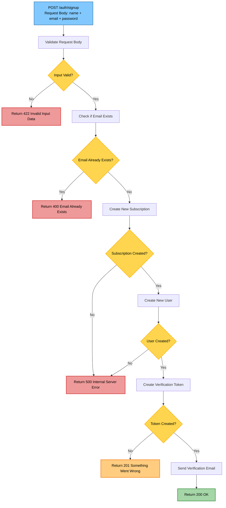
```mermaid
flowchart TD
%% API Flow: POST /auth/signup
Start[POST /auth/signup<br/>Request Body: name + email + password] --> ValidateInput[Validate Request Body]

ValidateInput --> InputValid{Input Valid?}
InputValid -->|No| Input422[Return 422 Invalid Input Data]
InputValid -->|Yes| CheckEmail[Check if Email Exists]

CheckEmail --> EmailExists{Email Already Exists?}
EmailExists -->|Yes| Email400[Return 400 Email Already Exists]
EmailExists -->|No| CreateSubscription[Create New Subscription]

CreateSubscription --> SubCreated{Subscription Created?}
SubCreated -->|No| Server500[Return 500 Internal Server Error]
SubCreated -->|Yes| CreateUser[Create New User]

CreateUser --> UserCreated{User Created?}
UserCreated -->|No| Server500
UserCreated -->|Yes| CreateToken[Create Verification Token]

CreateToken --> TokenCreated{Token Created?}
TokenCreated -->|No| Success201[Return 201 Something Went Wrong]
TokenCreated -->|Yes| SendEmail[Send Verification Email]

SendEmail --> Success200[Return 200 OK]

classDef startEnd fill:#81C8FF,stroke:#4682B4,stroke-width:2px,color:#000;
classDef decision fill:#FFD54F,stroke:#FFB300,stroke-width:2px,color:#000;
classDef success fill:#A5D6A7,stroke:#388E3C,stroke-width:2px,color:#000;
classDef error fill:#EF9A9A,stroke:#D32F2F,stroke-width:2px,color:#000;
classDef warning fill:#FFCC80,stroke:#F57C00,stroke-width:2px,color:#000;

class Start,Success200 startEnd
class InputValid,EmailExists,SubCreated,UserCreated,TokenCreated decision
class Success200 success
class Input422,Email400,Server500 error
class Success201 warning

``` 
</details>

---
| URL | Method | Auth Required | Description |
|-----|--------|---------------|-------------|
| `/auth/signin` | POST | False | Log in and start a session |

> <details>
> <summary>Request body</summary>
>
> ```json
> {
>   "email": "arjunsharma@gmail.com",
>   "password": "securePassword@123"
> }
> ```
> </details>
>
> <details>
> <summary>Response body</summary>
>
> ```json
> {
>   "statusCode": 200
> }
> ```
>
> **Response:** `200 OK` - Login successful</br>
> **Response:** `401 Unauthorized` - Invalid credentials</br>
> **Response:** `400 Bad Request` - Invalid input data
> </details>


<details>
<summary>Api Flow diagram</summary>

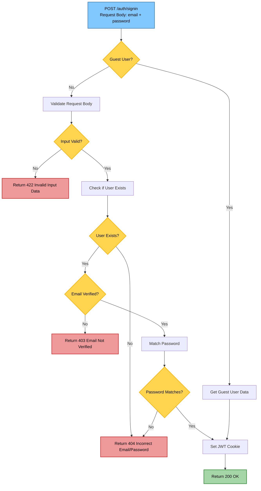
```mermaid
flowchart TD
%% API Flow: POST /auth/signin
Start[POST /auth/signin<br/>Request Body: email + password] --> GuestCheck{Guest User?}

GuestCheck -->|Yes| GetGuestUser[Get Guest User Data]
GuestCheck -->|No| ValidateInput[Validate Request Body]

ValidateInput --> InputValid{Input Valid?}
InputValid -->|No| Input422[Return 422 Invalid Input Data]
InputValid -->|Yes| CheckUser[Check if User Exists]

CheckUser --> UserExists{User Exists?}
UserExists -->|No| User404[Return 404 Incorrect Email/Password]
UserExists -->|Yes| CheckVerified{Email Verified?}

CheckVerified -->|No| Verify403[Return 403 Email Not Verified]
CheckVerified -->|Yes| VerifyPassword[Match Password]

VerifyPassword --> PasswordMatch{Password Matches?}
PasswordMatch -->|No| User404
PasswordMatch -->|Yes| SetCookie[Set JWT Cookie]

GetGuestUser --> SetCookie
SetCookie --> Success200[Return 200 OK]

classDef startEnd fill:#81C8FF,stroke:#4682B4,stroke-width:2px,color:#000;
classDef decision fill:#FFD54F,stroke:#FFB300,stroke-width:2px,color:#000;
classDef success fill:#A5D6A7,stroke:#388E3C,stroke-width:2px,color:#000;
classDef error fill:#EF9A9A,stroke:#D32F2F,stroke-width:2px,color:#000;
classDef warning fill:#FFCC80,stroke:#F57C00,stroke-width:2px,color:#000;

class Start,Success200 startEnd
class GuestCheck,InputValid,UserExists,CheckVerified,PasswordMatch decision
class Success200 success
class Input422,User404,Verify403 error

``` 
</details>

---
| URL | Method | Auth Required | Description |
|-----|--------|---------------|-------------|
| `/auth/signout` | POST | True | Terminate the session |

> <details>
> <summary>Response body</summary>
>
> ```json
> {
>   "message": "Logged out successfully",
>   "success": true
> }
> ```
>
> **Response:** `200 OK` - Logout successful</br>
> **Response:** `401 Unauthorized` - Not authenticated
> </details>


<details>
<summary>Api Flow diagram</summary>

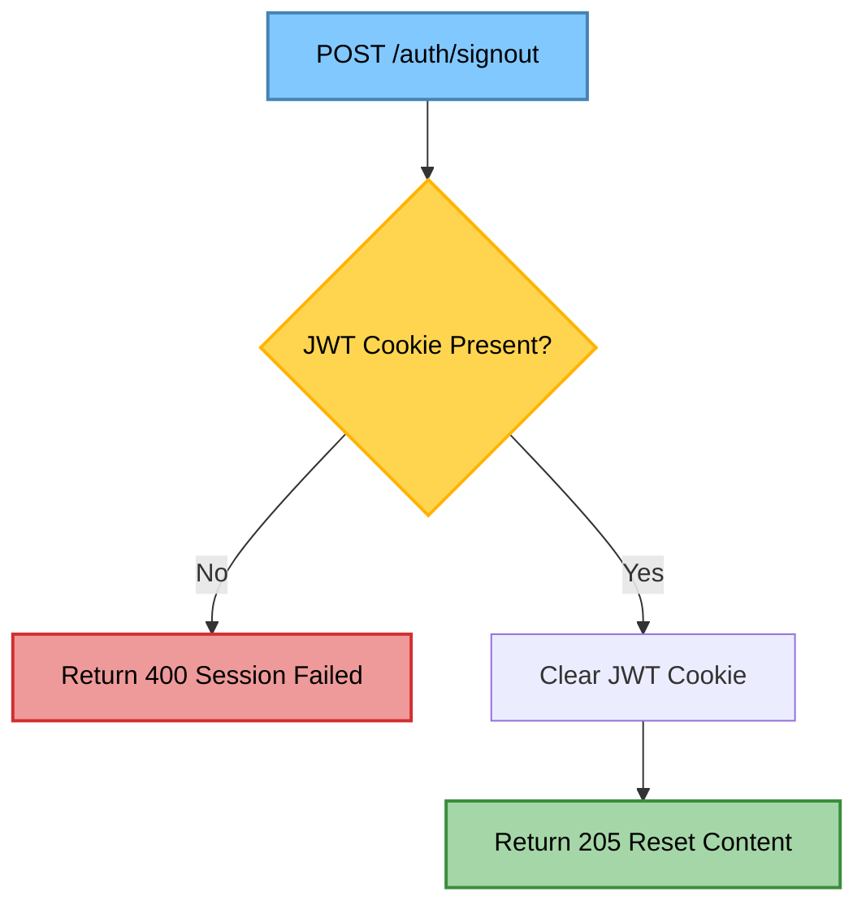
```mermaid
flowchart TD
%% API Flow: POST /auth/signout
Start[POST /auth/signout] --> CheckCookie{JWT Cookie Present?}

CheckCookie -->|No| Cookie400[Return 400 Session Failed]
CheckCookie -->|Yes| ClearCookie[Clear JWT Cookie]

ClearCookie --> Success205[Return 205 Reset Content]

classDef startEnd fill:#81C8FF,stroke:#4682B4,stroke-width:2px,color:#000;
classDef decision fill:#FFD54F,stroke:#FFB300,stroke-width:2px,color:#000;
classDef success fill:#A5D6A7,stroke:#388E3C,stroke-width:2px,color:#000;
classDef error fill:#EF9A9A,stroke:#D32F2F,stroke-width:2px,color:#000;
classDef warning fill:#FFCC80,stroke:#F57C00,stroke-width:2px,color:#000;

class Start,Success205 startEnd
class CheckCookie decision
class Success205 success
class Cookie400 error
``` 
</details>

---
| URL | Method | Auth Required | Description |
|-----|--------|---------------|-------------|
| `/auth/verify/:token?` | GET | False | Validate the user session token or verify email |

> <details>
> <summary>Response body</summary>
>
> ```json
> {
>   "statusCode" : 200
> }
> ```
>
> **Response:** `200 OK` - Token valid or email verified</br>
> **Response:** `400 Bad Request` - Invalid token</br>
> **Response:** `401 Unauthorized` - Invalid session
> </details>


<details>
<summary>Api Flow diagram</summary>

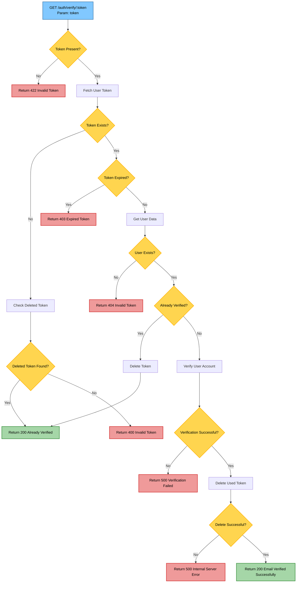
```mermaid
flowchart TD
%% API Flow: GET /auth/verify/:token
Start[GET /auth/verify/:token<br/>Param: token] --> ValidateToken{Token Present?}

ValidateToken -->|No| Token422[Return 422 Invalid Token]
ValidateToken -->|Yes| FetchToken[Fetch User Token]

FetchToken --> TokenExists{Token Exists?}
TokenExists -->|No| CheckDeleted[Check Deleted Token]
TokenExists -->|Yes| CheckExpiry{Token Expired?}

CheckDeleted --> DeletedExists{Deleted Token Found?}
DeletedExists -->|Yes| Already200[Return 200 Already Verified]
DeletedExists -->|No| Token400[Return 400 Invalid Token]

CheckExpiry -->|Yes| Expired403[Return 403 Expired Token]
CheckExpiry -->|No| GetUser[Get User Data]

GetUser --> UserExists{User Exists?}
UserExists -->|No| User404[Return 404 Invalid Token]
UserExists -->|Yes| AlreadyVerified{Already Verified?}

AlreadyVerified -->|Yes| DeleteToken[Delete Token]
DeleteToken --> Already200
AlreadyVerified -->|No| VerifyUser[Verify User Account]

VerifyUser --> VerifySuccess{Verification Successful?}
VerifySuccess -->|No| Verify500[Return 500 Verification Failed]
VerifySuccess -->|Yes| DeleteTokenSuccess[Delete Used Token]

DeleteTokenSuccess --> DeleteSuccess{Delete Successful?}
DeleteSuccess -->|No| Server500[Return 500 Internal Server Error]
DeleteSuccess -->|Yes| Success200[Return 200 Email Verified Successfully]

classDef startEnd fill:#81C8FF,stroke:#4682B4,stroke-width:2px,color:#000;
classDef decision fill:#FFD54F,stroke:#FFB300,stroke-width:2px,color:#000;
classDef success fill:#A5D6A7,stroke:#388E3C,stroke-width:2px,color:#000;
classDef error fill:#EF9A9A,stroke:#D32F2F,stroke-width:2px,color:#000;
classDef warning fill:#FFCC80,stroke:#F57C00,stroke-width:2px,color:#000;

class Start,Success200,Already200 startEnd
class ValidateToken,TokenExists,DeletedExists,CheckExpiry,UserExists,AlreadyVerified,VerifySuccess,DeleteSuccess decision
class Success200,Already200 success
class Token422,Token400,Expired403,User404,Verify500,Server500 error

``` 
</details>

---
| URL | Method | Auth Required | Description |
|-----|--------|---------------|-------------|
| `/auth/password/forgot` | POST | False | Initiate password recovery |

> <details>
> <summary>Request body</summary>
>
> ```json
> {
>   "email": "user@example.com"
> }
> ```
> </details>
>
> <details>
> <summary>Response body</summary>
>
> ```json
> {
>   "statusCode": 200
> }
> ```
>
> **Response:** `200 OK` - Password reset email sent</br>
> **Response:** `400 Bad Request` - Invalid email</br>
> **Response:** `404 Not Found` - Email not found
> </details>


<details>
<summary>Api Flow diagram</summary>

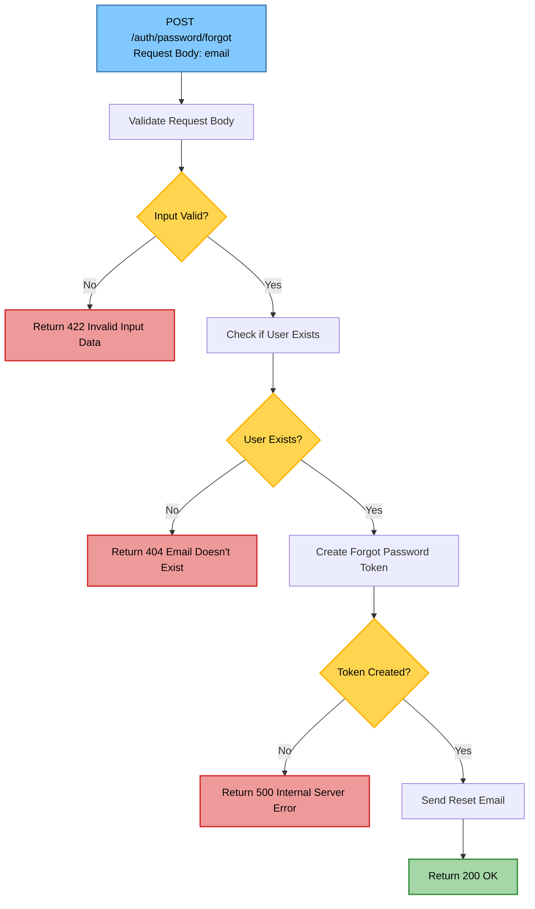
```mermaid

flowchart TD
%% API Flow: POST /auth/password/forgot
Start[POST /auth/password/forgot<br/>Request Body: email] --> ValidateInput[Validate Request Body]

ValidateInput --> InputValid{Input Valid?}
InputValid -->|No| Input422[Return 422 Invalid Input Data]
InputValid -->|Yes| CheckUser[Check if User Exists]

CheckUser --> UserExists{User Exists?}
UserExists -->|No| User404[Return 404 Email Doesn't Exist]
UserExists -->|Yes| CreateToken[Create Forgot Password Token]

CreateToken --> TokenCreated{Token Created?}
TokenCreated -->|No| Server500[Return 500 Internal Server Error]
TokenCreated -->|Yes| SendEmail[Send Reset Email]

SendEmail --> Success200[Return 200 OK]

classDef startEnd fill:#81C8FF,stroke:#4682B4,stroke-width:2px,color:#000;
classDef decision fill:#FFD54F,stroke:#FFB300,stroke-width:2px,color:#000;
classDef success fill:#A5D6A7,stroke:#388E3C,stroke-width:2px,color:#000;
classDef error fill:#EF9A9A,stroke:#D32F2F,stroke-width:2px,color:#000;
classDef warning fill:#FFCC80,stroke:#F57C00,stroke-width:2px,color:#000;

class Start,Success200 startEnd
class InputValid,UserExists,TokenCreated decision
class Success200 success
class Input422,User404,Server500 error

``` 
</details>

---
| URL | Method | Auth Required | Description |
|-----|--------|---------------|-------------|
| `/auth/password/forgot/:token?` | GET | False | Get password reset session |

> <details>
> <summary>Response body</summary>
>
> ```json
> {
>   "statusCode": 200
> }
> ```
>
> **Response:** `200 OK` - Token valid</br>
> **Response:** `400 Bad Request` - Invalid token</br>
> **Response:** `401 Unauthorized` - Token expired
> </details>


<details>
<summary>Api Flow diagram</summary>

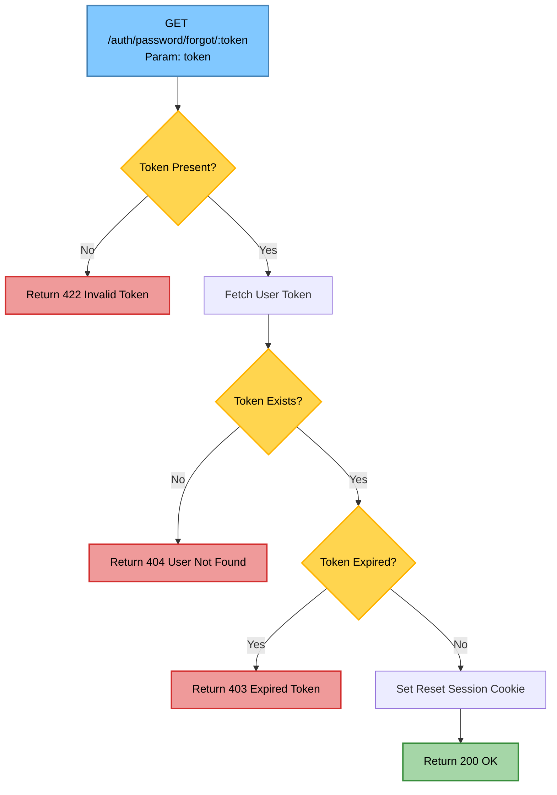
```mermaid

flowchart TD
%% API Flow: GET /auth/password/forgot/:token
Start[GET /auth/password/forgot/:token<br/>Param: token] --> ValidateToken{Token Present?}

ValidateToken -->|No| Token422[Return 422 Invalid Token]
ValidateToken -->|Yes| FetchToken[Fetch User Token]

FetchToken --> TokenExists{Token Exists?}
TokenExists -->|No| User404[Return 404 User Not Found]
TokenExists -->|Yes| CheckExpiry{Token Expired?}

CheckExpiry -->|Yes| Expired403[Return 403 Expired Token]
CheckExpiry -->|No| SetCookie[Set Reset Session Cookie]

SetCookie --> Success200[Return 200 OK]

classDef startEnd fill:#81C8FF,stroke:#4682B4,stroke-width:2px,color:#000;
classDef decision fill:#FFD54F,stroke:#FFB300,stroke-width:2px,color:#000;
classDef success fill:#A5D6A7,stroke:#388E3C,stroke-width:2px,color:#000;
classDef error fill:#EF9A9A,stroke:#D32F2F,stroke-width:2px,color:#000;
classDef warning fill:#FFCC80,stroke:#F57C00,stroke-width:2px,color:#000;

class Start,Success200 startEnd
class ValidateToken,TokenExists,CheckExpiry decision
class Success200 success
class Token422,User404,Expired403 error

``` 
</details>

---
| URL | Method | Auth Required | Description |
|-----|--------|---------------|-------------|
| `/auth/password/reset` | PATCH | False | Reset user password |

> <details>
> <summary>Request body</summary>
>
> ```json
> {
>   "token": "resetToken123",
>   "newPassword": "newSecurePassword@123",
>   "confirmPassword" : "newSecurePassword@123"
> }
> ```
> </details>
>
> <details>
> <summary>Response body</summary>
>
> ```json
> {
>   "statusCode": 200
> }
> ```
>
> **Response:** `200 OK` - Password reset successful</br>
> **Response:** `400 Bad Request` - Invalid input data</br>
> **Response:** `401 Unauthorized` - Invalid or expired token
> </details>


<details>
<summary>Api Flow diagram</summary>

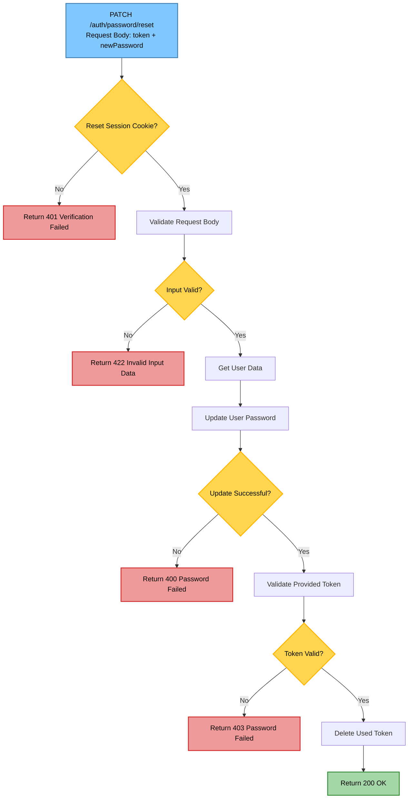
```mermaid
flowchart TD
%% API Flow: PATCH /auth/password/reset
Start[PATCH /auth/password/reset<br/>Request Body: token + newPassword] --> CheckSession{Reset Session Cookie?}

CheckSession -->|No| Session401[Return 401 Verification Failed]
CheckSession -->|Yes| ValidateInput[Validate Request Body]

ValidateInput --> InputValid{Input Valid?}
InputValid -->|No| Input422[Return 422 Invalid Input Data]
InputValid -->|Yes| GetUser[Get User Data]

GetUser --> UpdatePassword[Update User Password]
UpdatePassword --> UpdateSuccess{Update Successful?}

UpdateSuccess -->|No| Password400[Return 400 Password Failed]
UpdateSuccess -->|Yes| ValidateToken[Validate Provided Token]

ValidateToken --> TokenValid{Token Valid?}
TokenValid -->|No| Token403[Return 403 Password Failed]
TokenValid -->|Yes| DeleteToken[Delete Used Token]

DeleteToken --> Success200[Return 200 OK]

classDef startEnd fill:#81C8FF,stroke:#4682B4,stroke-width:2px,color:#000;
classDef decision fill:#FFD54F,stroke:#FFB300,stroke-width:2px,color:#000;
classDef success fill:#A5D6A7,stroke:#388E3C,stroke-width:2px,color:#000;
classDef error fill:#EF9A9A,stroke:#D32F2F,stroke-width:2px,color:#000;
classDef warning fill:#FFCC80,stroke:#F57C00,stroke-width:2px,color:#000;

class Start,Success200 startEnd
class CheckSession,InputValid,UpdateSuccess,TokenValid decision
class Success200 success
class Session401,Input422,Password400,Token403 error

``` 
</details>

---
| URL | Method | Auth Required | Description |
|-----|--------|---------------|-------------|
| `/auth/password/validate-session` | GET | False | Validate user session cookie |

> <details>
> <summary>Response body</summary>
>
> ```json
> {
>   "statusCode": 200,
>   "userData" : {
>     "name": "john",
>     "email": "johndoe@example.com",
>     "role": "ADMIN",
>     "is_verified": true,
>     "subscription_id": "6850237718e51707367387bd",
>     "userId": "6850237718e51707367387bf",
>     "created_at": "2025-06-16T14:00:23.000Z",
>     "is_deleted": false,
>     "updated_at": "2025-06-16T14:00:23.183Z"
>   }
> }
> ```
> **Response:** `200 OK` - successfully Validated</br>
> **Response:** `401 Unauthorized` - Invalid Credentials
> </details>

</details>


<details>
<summary>Api Flow diagram</summary>

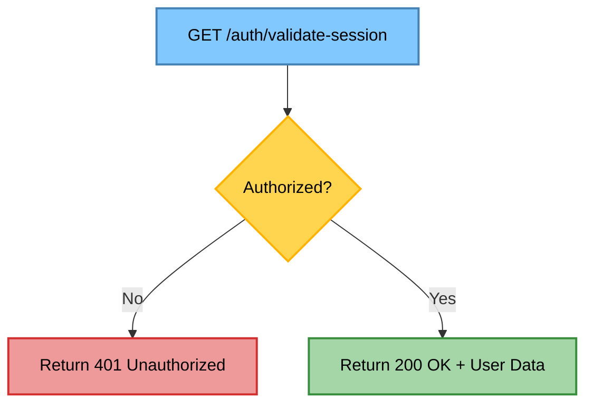
```mermaid

flowchart TD
%% API Flow: GET /auth/validate-session
Start[GET /auth/validate-session] --> Auth{Authorized?}

Auth -->|No| Auth401[Return 401 Unauthorized]
Auth -->|Yes| Success200[Return 200 OK + User Data]

classDef startEnd fill:#81C8FF,stroke:#4682B4,stroke-width:2px,color:#000;
classDef decision fill:#FFD54F,stroke:#FFB300,stroke-width:2px,color:#000;
classDef success fill:#A5D6A7,stroke:#388E3C,stroke-width:2px,color:#000;
classDef error fill:#EF9A9A,stroke:#D32F2F,stroke-width:2px,color:#000;
classDef warning fill:#FFCC80,stroke:#F57C00,stroke-width:2px,color:#000;

class Start,Success200 startEnd
class Auth decision
class Success200 success
class Auth401 error

``` 
</details>


<details>
<summary>USER</summary>

| URL | Method | Auth Required | Description |
|-----|--------|---------------|-------------|
| `/user/me` | GET | True | Retrieve authenticated user profile |

> <details>
> <summary>Response body</summary>
>
> ```json
> {
>    "statusCode": 200,
>    "data": {
>        "name": "ahrak nivah",
>        "email": "enyyvish@gmail.com",
>        "role": "CUSTOMER",
>        "is_verified": true,
>        "subscription_id": "6826d68a0fbea0d79998ef43",
>        "userId": "6826d68a0fbea0d79998ef45",
>        "created_at": "2025-05-16T06:09:14.000Z",
>        "is_deleted": false,
>        "updated_at": "2025-05-16T06:09:14.513Z",
>        "subscription": {
>            "_id": "6826d68a0fbea0d79998ef43",
>            "type": "HOBBY",
>            "key_limit": 2,
>            "usage_limit": 500,
>            "usage_count": 0,
>            "is_active": true,
>            "updated_at": "2025-05-16T06:09:14.288Z"
>        },
>        "keys": []
>    }
>}
> ```
>
> **Response:** `200 OK` - User profile retrieved successfully</br>
> **Response:** `401 Unauthorized` - Not authenticated</br>
> **Response:** `404 Not Found` - User not found
> </details>

<details>
<summary>Api Flow diagram</summary>

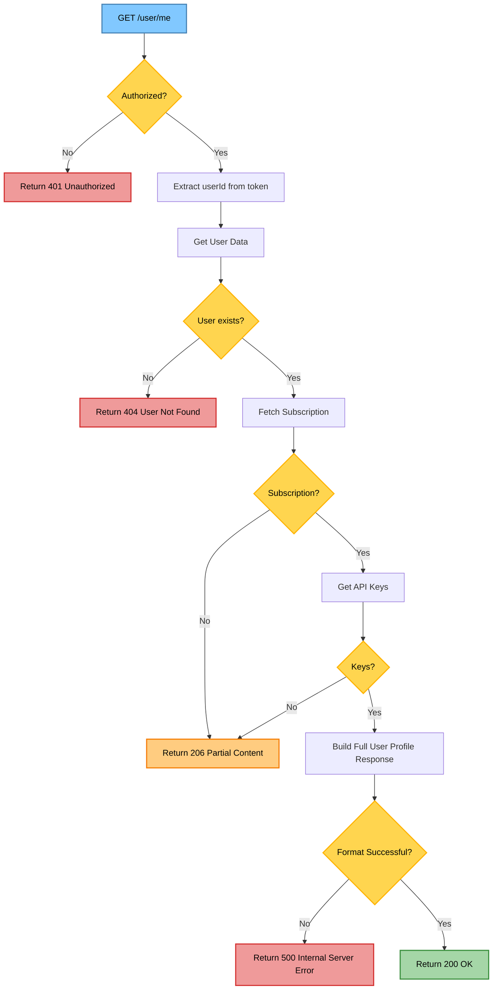
```mermaid
 flowchart TD
%% API Flow: GET /user/me
Start[GET /user/me] --> Auth{Authorized?}

Auth -->|No| Auth401[Return 401 Unauthorized]
Auth -->|Yes| ExtractUserId[Extract userId from token]

ExtractUserId --> GetUser[Get User Data]
GetUser --> UserExists{User exists?}

UserExists -->|No| User404[Return 404 User Not Found]
UserExists -->|Yes| GetSubscription[Fetch Subscription]

GetSubscription --> SubExists{Subscription?}
SubExists -->|No| Partial206[Return 206 Partial Content]
SubExists -->|Yes| GetKeys[Get API Keys]

GetKeys --> KeysFound{Keys?}
KeysFound -->|No| Partial206
KeysFound -->|Yes| FormatData[Build Full User Profile Response]

FormatData --> FormatSuccess{Format Successful?}
FormatSuccess -->|No| FormatError500[Return 500 Internal Server Error]
FormatSuccess -->|Yes| Success200[Return 200 OK]

classDef startEnd fill:#81C8FF,stroke:#4682B4,stroke-width:2px,color:#000;
classDef decision fill:#FFD54F,stroke:#FFB300,stroke-width:2px,color:#000;
classDef success fill:#A5D6A7,stroke:#388E3C,stroke-width:2px,color:#000;
classDef error fill:#EF9A9A,stroke:#D32F2F,stroke-width:2px,color:#000;
classDef warning fill:#FFCC80,stroke:#F57C00,stroke-width:2px,color:#000;

class Start,Success200 startEnd
class Auth,UserExists,SubExists,KeysFound,FormatSuccess decision
class Success200 success
class Auth401,User404,FormatError500 error
class Partial206 warning

``` 
</details>

---
| URL | Method | Auth Required | Description |
|-----|--------|---------------|-------------|
| `/user/me` | PATCH | True | Update user profile details |

> <details>
> <summary>Request body</summary>
>
> ```json
>  {
>    "name": "local lamma"
>  }
>
> ```
> </details>
>
> <details>
> <summary>Response body</summary>
>
> ```json
> {
>   "statusCode" : 200
> }
> ```
>
> **Response:** `200 OK` - Profile updated successfully</br>
> **Response:** `400 Bad Request` - Invalid input data</br>
> **Response:** `401 Unauthorized` - Not authenticated
> </details>

<details>
<summary>Api Flow diagram</summary>

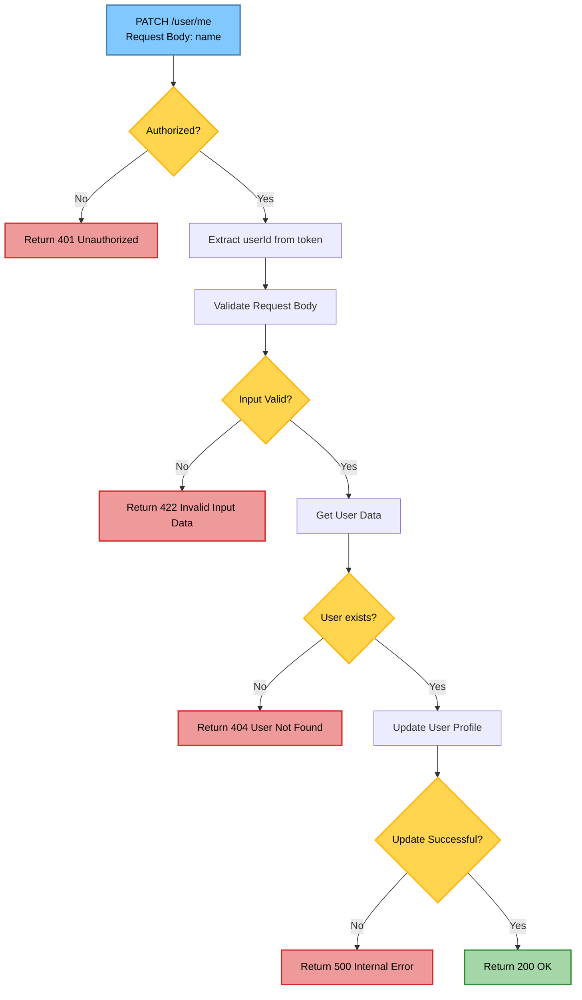
```mermaid
flowchart TD
%% API Flow: PATCH /user/me
Start[PATCH /user/me<br/>Request Body: name] --> Auth{Authorized?}

Auth -->|No| Auth401[Return 401 Unauthorized]
Auth -->|Yes| ExtractUserId[Extract userId from token]

ExtractUserId --> ValidateInput[Validate Request Body]
ValidateInput --> InputValid{Input Valid?}

InputValid -->|No| Input422[Return 422 Invalid Input Data]
InputValid -->|Yes| GetUser[Get User Data]

GetUser --> UserExists{User exists?}

UserExists -->|No| User404[Return 404 User Not Found]
UserExists -->|Yes| UpdateUser[Update User Profile]

UpdateUser --> UpdateSuccess{Update Successful?}
UpdateSuccess -->|No| Server500[Return 500 Internal Error]
UpdateSuccess -->|Yes| Success200[Return 200 OK]

classDef startEnd fill:#81C8FF,stroke:#4682B4,stroke-width:2px,color:#000;
classDef decision fill:#FFD54F,stroke:#FFB300,stroke-width:2px,color:#000;
classDef success fill:#A5D6A7,stroke:#388E3C,stroke-width:2px,color:#000;
classDef error fill:#EF9A9A,stroke:#D32F2F,stroke-width:2px,color:#000;
classDef warning fill:#FFCC80,stroke:#F57C00,stroke-width:2px,color:#000;

class Start,Success200 startEnd
class Auth,InputValid,UserExists,UpdateSuccess decision
class Success200 success
class Auth401,Input422,User404,Server500 error

```
</details>

---
| URL | Method | Auth Required | Description |
|-----|--------|---------------|-------------|
| `/user/me` | DELETE | True | Permanently delete the user account |

> <details>
> <summary>Response body</summary>
>
> ```json
> {
>   "statusCode": 200
> }
> ```
> 
> **Response:** `200 OK` - Account deleted successfully</br>
> **Response:** `401 Unauthorized` - Not authenticated</br>
> **Response:** `404 Not Found` - User not found
> </details>


<details>
<summary>Api Flow diagram</summary>

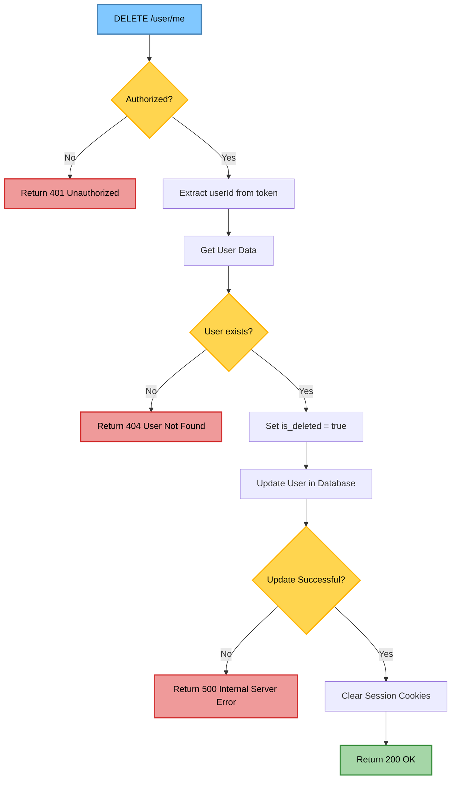
```mermaid
flowchart TD
%% API Flow: DELETE /user/me
Start[DELETE /user/me] --> Auth{Authorized?}

Auth -->|No| Auth401[Return 401 Unauthorized]
Auth -->|Yes| ExtractUserId[Extract userId from token]

ExtractUserId --> GetUser[Get User Data]
GetUser --> UserExists{User exists?}

UserExists -->|No| User404[Return 404 User Not Found]
UserExists -->|Yes| SoftDelete[Set is_deleted = true]

SoftDelete --> UpdateUser[Update User in Database]
UpdateUser --> UpdateSuccess{Update Successful?}

UpdateSuccess -->|No| Server500[Return 500 Internal Server Error]
UpdateSuccess -->|Yes| ClearCookies[Clear Session Cookies]

ClearCookies --> Success200[Return 200 OK]

classDef startEnd fill:#81C8FF,stroke:#4682B4,stroke-width:2px,color:#000;
classDef decision fill:#FFD54F,stroke:#FFB300,stroke-width:2px,color:#000;
classDef success fill:#A5D6A7,stroke:#388E3C,stroke-width:2px,color:#000;
classDef error fill:#EF9A9A,stroke:#D32F2F,stroke-width:2px,color:#000;
classDef warning fill:#FFCC80,stroke:#F57C00,stroke-width:2px,color:#000;

class Start,Success200 startEnd
class Auth,UserExists,UpdateSuccess decision
class Success200 success
class Auth401,User404,Server500 error
class SoftDelete,UpdateUser,ClearCookies process

```
</details>

---
| URL | Method | Auth Required | Description |
|-----|--------|---------------|-------------|
| `/user/me/api-key` | POST | True | Generate a new API key |

> <details>
> <summary>Request body</summary>
>
> ```json
> {
>   "key_description": "sample key"
> }
> ```
> </details>
>
> <details>
> <summary>Response body</summary>
>
> ```json
> {
>    "statusCode": 200,
>    "data": {
>        "key_description": "sample key",
>        "subscription_id": "6826d68a0fbea0d79998ef43",
>        "_id": "684d52e03469f433197aa44a",
>        "api_key": "10E38C50555040A2A0220B6DB0AFDAE4",
>        "updated_at": "2025-06-14T10:45:52.395Z",
>        "__v": 0
>    }
> }
> ```
> 
> **Response:** `200 OK` - API key generated successfully</br>
> **Response:** `400 Bad Request` - Invalid input data</br>
> **Response:** `401 Unauthorized` - Not authenticated</br>
> **Response:** `403 Forbidden` - Key limit reached
> </details>

<details>
<summary>Api Flow diagram</summary>

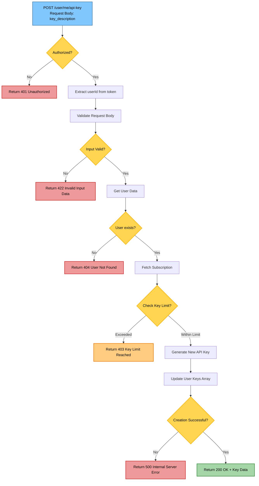
```mermaid
flowchart TD
%% API Flow: POST /user/me/api-key
Start[POST /user/me/api-key<br/>Request Body: key_description] --> Auth{Authorized?}

Auth -->|No| Auth401[Return 401 Unauthorized]
Auth -->|Yes| ExtractUserId[Extract userId from token]

ExtractUserId --> ValidateInput[Validate Request Body]
ValidateInput --> InputValid{Input Valid?}

InputValid -->|No| Input422[Return 422 Invalid Input Data]
InputValid -->|Yes| GetUser[Get User Data]

GetUser --> UserExists{User exists?}
UserExists -->|No| User404[Return 404 User Not Found]
UserExists -->|Yes| GetSubscription[Fetch Subscription]

GetSubscription --> CheckLimit{Check Key Limit?}
CheckLimit -->|Exceeded| Limit403[Return 403 Key Limit Reached]
CheckLimit -->|Within Limit| GenerateKey[Generate New API Key]

GenerateKey --> UpdateUser[Update User Keys Array]
UpdateUser --> CreateSuccess{Creation Successful?}

CreateSuccess -->|No| Server500[Return 500 Internal Server Error]
CreateSuccess -->|Yes| Success200[Return 200 OK + Key Data]

classDef startEnd fill:#81C8FF,stroke:#4682B4,stroke-width:2px,color:#000;
classDef decision fill:#FFD54F,stroke:#FFB300,stroke-width:2px,color:#000;
classDef success fill:#A5D6A7,stroke:#388E3C,stroke-width:2px,color:#000;
classDef error fill:#EF9A9A,stroke:#D32F2F,stroke-width:2px,color:#000;
classDef warning fill:#FFCC80,stroke:#F57C00,stroke-width:2px,color:#000;

class Start,Success200 startEnd
class Auth,InputValid,UserExists,CheckLimit,CreateSuccess decision
class Success200 success
class Auth401,Input422,User404,Server500 error
class Limit403 warning

```
</details>

---
| URL | Method | Auth Required | Description |
|-----|--------|---------------|-------------|
| `/user/me/api-key/:keyId` | DELETE | True | Revoke an API key |

> <details>
> <summary>Response body</summary>
>
> ```json
> {
>   "statusCode":200
> }
> ```
> 
> **Response:** `200 OK` - API key revoked successfully</br>
> **Response:** `401 Unauthorized` - Not authenticated</br>
> **Response:** `404 Not Found` - API key not found
> </details>

<details>
<summary>Api Flow diagram</summary>

 ```mermaid
flowchart TD
%% API Flow: DELETE /user/me/api-key/:keyId
Start[DELETE /user/me/api-key/:keyId<br/>Param: keyId] --> Auth{Authorized?}

Auth -->|No| Auth401[Return 401 Unauthorized]
Auth -->|Yes| ExtractUserId[Extract userId from token]

ExtractUserId --> ExtractKeyId[Extract keyId from params]
ExtractKeyId --> GetKey[Get API Key Data]

GetKey --> KeyExists{Key exists?}
KeyExists -->|No| Key404[Return 404 API Key Not Found]
KeyExists -->|Yes| CheckOwnership{User Owns Key?}

CheckOwnership -->|No| Key404
CheckOwnership -->|Yes| DeleteKey[Delete API Key]

DeleteKey --> UpdateUser[Remove from User Keys Array]
UpdateUser --> DeleteSuccess{Deletion Successful?}

DeleteSuccess -->|No| Server500[Return 500 Internal Server Error]
DeleteSuccess -->|Yes| Success200[Return 200 OK]

classDef startEnd fill:#81C8FF,stroke:#4682B4,stroke-width:2px,color:#000;
classDef decision fill:#FFD54F,stroke:#FFB300,stroke-width:2px,color:#000;
classDef success fill:#A5D6A7,stroke:#388E3C,stroke-width:2px,color:#000;
classDef error fill:#EF9A9A,stroke:#D32F2F,stroke-width:2px,color:#000;
classDef warning fill:#FFCC80,stroke:#F57C00,stroke-width:2px,color:#000;

class Start,Success200 startEnd
class Auth,KeyExists,CheckOwnership,DeleteSuccess decision
class Success200 success
class Auth401,Key404,Server500 error

```
</details>

---
| URL | Method | Auth Required | Description |
|-----|--------|---------------|-------------|
| `/user/me/password` | PUT | True | Update user password |

> <details>
> <summary>Request body</summary>
>
> ```json
> {
>   "currPassword": "oldPassword123",
>   "newPassword": "newPassword123"
> }
> ```
> </details>
>
> <details>
> <summary>Response body</summary>
>
> ```json
> {
>   "statusCode": 200
> }
> ```
> 
> **Response:** `200 OK` - Password updated successfully</br>
> **Response:** `400 Bad Request` - Invalid input data</br>
> **Response:** `401 Unauthorized` - Not authenticated or invalid current password
> </details>

 <details>
<summary>Api Flow diagram</summary>

 ```mermaid
flowchart TD
%% API Flow: PUT /user/me/password
Start[PUT /user/me/password<br/>Request Body: currPassword + newPassword] --> Auth{Authorized?}

Auth -->|No| Auth401[Return 401 Unauthorized]
Auth -->|Yes| ExtractUserId[Extract userId from token]

ExtractUserId --> ValidateInput[Validate Request Body]
ValidateInput --> InputValid{Input Valid?}

InputValid -->|No| Input422[Return 422 Invalid Input Data]
InputValid -->|Yes| GetUser[Get User Data]

GetUser --> UserExists{User exists?}
UserExists -->|No| User404[Return 404 User Not Found]
UserExists -->|Yes| VerifyPassword[Verify Current Password]

VerifyPassword --> PasswordMatch{Password Matches?}
PasswordMatch -->|No| Password400[Return 400 Incorrect Password]
PasswordMatch -->|Yes| HashNewPassword[Hash New Password]

HashNewPassword --> UpdateUser[Update User Password]
UpdateUser --> UpdateSuccess{Update Successful?}

UpdateSuccess -->|No| Server500[Return 500 Internal Server Error]
UpdateSuccess -->|Yes| Success200[Return 200 OK]

classDef startEnd fill:#81C8FF,stroke:#4682B4,stroke-width:2px,color:#000;
classDef decision fill:#FFD54F,stroke:#FFB300,stroke-width:2px,color:#000;
classDef success fill:#A5D6A7,stroke:#388E3C,stroke-width:2px,color:#000;
classDef error fill:#EF9A9A,stroke:#D32F2F,stroke-width:2px,color:#000;
classDef warning fill:#FFCC80,stroke:#F57C00,stroke-width:2px,color:#000;

class Start,Success200 startEnd
class Auth,InputValid,UserExists,PasswordMatch,UpdateSuccess decision
class Success200 success
class Auth401,Input422,User404,Password400,Server500 error

```
</details>

---
| URL | Method | Auth Required | Description |
|-----|--------|---------------|-------------|
| `/user/me/request` | POST | True | Raise logo Request |

> <details>
> <summary>Request body</summary>
>
> ```json
> {
>   "user_id": "6826d68a0fbea0d79998ef45",
>   "companyUrl": "https://company.com"
> }
> ```
> </details>
>
> <details>
> <summary>Response body</summary>
>
> ```json
> {
>   "statusCode": 200
> }
> ```
>
> **Response:** `200 OK` - Logo request submitted successfully</br>
> **Response:** `400 Bad Request` - Invalid input data</br>
> **Response:** `401 Unauthorized` - Not authenticated
> </details>

<details>
<summary>Api Flow diagram</summary>

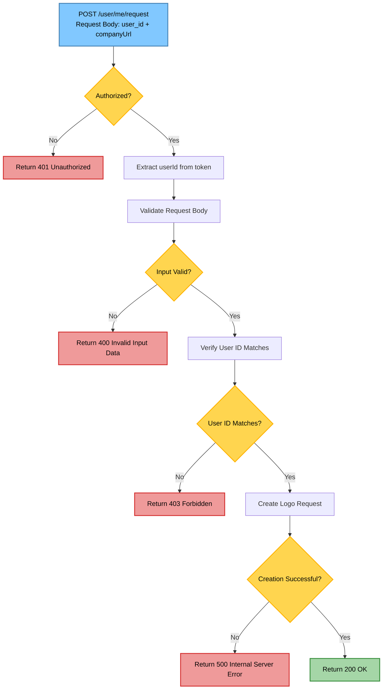
```mermaid
flowchart TD
%% API Flow: POST /user/me/request
Start[POST /user/me/request<br/>Request Body: user_id + companyUrl] --> Auth{Authorized?}

Auth -->|No| Auth401[Return 401 Unauthorized]
Auth -->|Yes| ExtractUserId[Extract userId from token]

ExtractUserId --> ValidateInput[Validate Request Body]
ValidateInput --> InputValid{Input Valid?}

InputValid -->|No| Input400[Return 400 Invalid Input Data]
InputValid -->|Yes| CheckUser[Verify User ID Matches]

CheckUser --> UserMatch{User ID Matches?}
UserMatch -->|No| User403[Return 403 Forbidden]
UserMatch -->|Yes| CreateRequest[Create Logo Request]

CreateRequest --> CreateSuccess{Creation Successful?}
CreateSuccess -->|No| Server500[Return 500 Internal Server Error]
CreateSuccess -->|Yes| Success200[Return 200 OK]

classDef startEnd fill:#81C8FF,stroke:#4682B4,stroke-width:2px,color:#000;
classDef decision fill:#FFD54F,stroke:#FFB300,stroke-width:2px,color:#000;
classDef success fill:#A5D6A7,stroke:#388E3C,stroke-width:2px,color:#000;
classDef error fill:#EF9A9A,stroke:#D32F2F,stroke-width:2px,color:#000;
classDef warning fill:#FFCC80,stroke:#F57C00,stroke-width:2px,color:#000;

class Start,Success200 startEnd
class Auth,InputValid,UserMatch,CreateSuccess decision
class Success200 success
class Auth401,Input400,User403,Server500 error

```
</details>
</details>

<details>
<summary>ADMIN</summary>

| URL | Method | Auth Required | Description |
|-----|--------|---------------|-------------|
| `/catalog/stats` | GET | True | Get the user statistics |

> <details>
> <summary>Response body</summary>
>
> ```json
> {
>   "statusCode": 200,
>   "data": {
>     "Users": 10,
>     "Keys": 2,
>     "Requests": 0,
>     "Hits": 0
>   }
> }
> ```
>
> **Response:** `200 OK` - Statistics retrieved successfully</br>
> **Response:** `401 Unauthorized` - Not authenticated</br>
> **Response:** `403 Forbidden` - Not authorized
> </details>
<details>
<summary>Api flow diagram</summary>
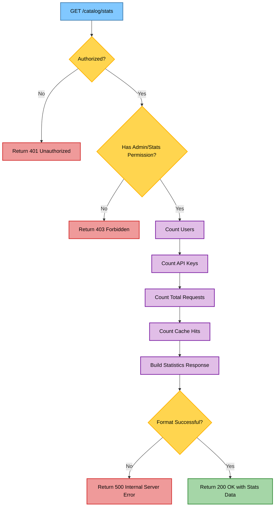
```mermaid
flowchart TD
%% API Flow: GET /catalog/stats
Start[GET /catalog/stats] --> Auth{Authorized?}
Auth -->|No| Auth401[Return 401 Unauthorized]
Auth -->|Yes| CheckPerms{Has Admin/Stats Permission?}
CheckPerms -->|No| Forbidden403[Return 403 Forbidden]
CheckPerms -->|Yes| GetUsers[Count Users]
GetUsers --> GetKeys[Count API Keys]
GetKeys --> GetRequests[Count Total Requests]
GetRequests --> GetHits[Count Cache Hits]
GetHits --> BuildStats[Build Statistics Response]
BuildStats --> FormatSuccess{Format Successful?}
FormatSuccess -->|No| FormatError500[Return 500 Internal Server Error]
FormatSuccess -->|Yes| Success200[Return 200 OK with Stats Data]

classDef startEnd fill:#81C8FF,stroke:#4682B4,stroke-width:2px,color:#000;
classDef decision fill:#FFD54F,stroke:#FFB300,stroke-width:2px,color:#000;
classDef success fill:#A5D6A7,stroke:#388E3C,stroke-width:2px,color:#000;
classDef error fill:#EF9A9A,stroke:#D32F2F,stroke-width:2px,color:#000;
classDef process fill:#E1BEE7,stroke:#7B1FA2,stroke-width:2px,color:#000;

class Start,Success200 startEnd
class Auth,CheckPerms,FormatSuccess decision
class Success200 success
class Auth401,Forbidden403,FormatError500 error
class GetUsers,GetKeys,GetRequests,GetHits,BuildStats process

```
</details>

---
| URL | Method | Auth Required | Description |
|-----|--------|---------------|-------------|
| `/catalog/permission/:userId/roles/:role` | PUT | True | Assign or modify user roles |

> <details>
> <summary>Request body</summary>
>
> ```json
> {
>   "email": "email@user.com"
> }
> ```
>
> </details>
> <details>
> <summary>Response body</summary>
>
> ```json
> {
>   "statusCode": 200
> }
> ```
>
> **Response:** `200 OK` - Role updated successfully</br>
> **Response:** `400 Bad Request` - Invalid role</br>
> **Response:** `401 Unauthorized` - Not authenticated</br>
> **Response:** `403 Forbidden` - Not authorized</br>
> **Response:** `404 Not Found` - User not found
> </details>

<details>
<summary>Api flow diagram </summary>
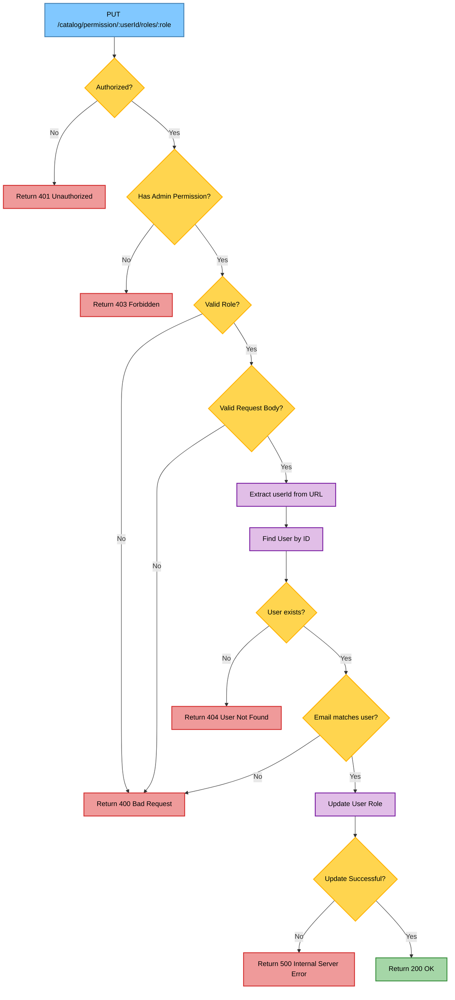
```mermaid
flowchart TD
%% API Flow: PUT /catalog/permission/:userId/roles/:role
Start[PUT /catalog/permission/:userId/roles/:role] --> Auth{Authorized?}
Auth -->|No| Auth401[Return 401 Unauthorized]
Auth -->|Yes| CheckPerms{Has Admin Permission?}
CheckPerms -->|No| Forbidden403[Return 403 Forbidden]
CheckPerms -->|Yes| ValidateRole{Valid Role?}
ValidateRole -->|No| BadRequest400[Return 400 Bad Request]
ValidateRole -->|Yes| ValidateBody{Valid Request Body?}
ValidateBody -->|No| BadRequest400
ValidateBody -->|Yes| ExtractUserId[Extract userId from URL]
ExtractUserId --> FindUser[Find User by ID]
FindUser --> UserExists{User exists?}
UserExists -->|No| NotFound404[Return 404 User Not Found]
UserExists -->|Yes| ValidateEmail{Email matches user?}
ValidateEmail -->|No| BadRequest400
ValidateEmail -->|Yes| UpdateRole[Update User Role]
UpdateRole --> UpdateSuccess{Update Successful?}
UpdateSuccess -->|No| UpdateError500[Return 500 Internal Server Error]
UpdateSuccess -->|Yes| Success200[Return 200 OK]

classDef startEnd fill:#81C8FF,stroke:#4682B4,stroke-width:2px,color:#000;
classDef decision fill:#FFD54F,stroke:#FFB300,stroke-width:2px,color:#000;
classDef success fill:#A5D6A7,stroke:#388E3C,stroke-width:2px,color:#000;
classDef error fill:#EF9A9A,stroke:#D32F2F,stroke-width:2px,color:#000;
classDef process fill:#E1BEE7,stroke:#7B1FA2,stroke-width:2px,color:#000;

class Start,Success200 startEnd
class Auth,CheckPerms,ValidateRole,ValidateBody,UserExists,ValidateEmail,UpdateSuccess decision
class Success200 success
class Auth401,Forbidden403,BadRequest400,NotFound404,UpdateError500 error
class ExtractUserId,FindUser,UpdateRole process
```
<details>
---
| URL | Method | Auth Required | Description |
|-----|--------|---------------|-------------|
| `/catalog/logo` | POST | True | Upload a new company logo |

> <details>
> <summary>Request body</summary>
>
> ```
> Form Data:
>   logo: File - The logo file to upload
>   companyUri: string - The company URL
> ```
> </details>
>
> <details>
> <summary>Response body</summary>
>
> ```json
> {
>   "statusCode": 200,
>   "message": "Image updated successfully.",
>   "data": {
>     "_id": "image_id",
>     "updatedAt": "timestamp"
>   }
> }
> ```
>
> **Response:** `200 OK` - Logo uploaded successfully </br>
> **Response:** `400 Bad Request` - Invalid input data</br>
> **Response:** `401 Unauthorized` - Not authenticated</br>
> **Response:** `403 Forbidden` - Not authorized
> </details>
<details>
<summary>Api flow diagram </summary>
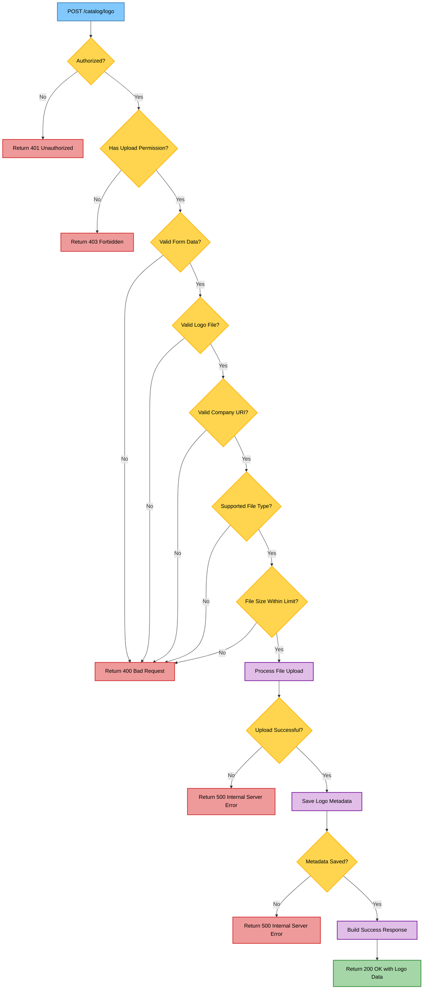
```mermaid
flowchart TD
%% API Flow: POST /catalog/logo
Start[POST /catalog/logo] --> Auth{Authorized?}
Auth -->|No| Auth401[Return 401 Unauthorized]
Auth -->|Yes| CheckPerms{Has Upload Permission?}
CheckPerms -->|No| Forbidden403[Return 403 Forbidden]
CheckPerms -->|Yes| ValidateFormData{Valid Form Data?}
ValidateFormData -->|No| BadRequest400[Return 400 Bad Request]
ValidateFormData -->|Yes| ValidateFile{Valid Logo File?}
ValidateFile -->|No| BadRequest400
ValidateFile -->|Yes| ValidateUri{Valid Company URI?}
ValidateUri -->|No| BadRequest400
ValidateUri -->|Yes| CheckFileType{Supported File Type?}
CheckFileType -->|No| BadRequest400
CheckFileType -->|Yes| CheckFileSize{File Size Within Limit?}
CheckFileSize -->|No| BadRequest400
CheckFileSize -->|Yes| ProcessUpload[Process File Upload]
ProcessUpload --> UploadSuccess{Upload Successful?}
UploadSuccess -->|No| UploadError500[Return 500 Internal Server Error]
UploadSuccess -->|Yes| SaveMetadata[Save Logo Metadata]
SaveMetadata --> MetadataSuccess{Metadata Saved?}
MetadataSuccess -->|No| MetadataError500[Return 500 Internal Server Error]
MetadataSuccess -->|Yes| BuildResponse[Build Success Response]
BuildResponse --> Success200[Return 200 OK with Logo Data]

classDef startEnd fill:#81C8FF,stroke:#4682B4,stroke-width:2px,color:#000;
classDef decision fill:#FFD54F,stroke:#FFB300,stroke-width:2px,color:#000;
classDef success fill:#A5D6A7,stroke:#388E3C,stroke-width:2px,color:#000;
classDef error fill:#EF9A9A,stroke:#D32F2F,stroke-width:2px,color:#000;
classDef process fill:#E1BEE7,stroke:#7B1FA2,stroke-width:2px,color:#000;

class Start,Success200 startEnd
class Auth,CheckPerms,ValidateFormData,ValidateFile,ValidateUri,CheckFileType,CheckFileSize,UploadSuccess,MetadataSuccess decision
class Success200 success
class Auth401,Forbidden403,BadRequest400,UploadError500,MetadataError500 error
class ProcessUpload,SaveMetadata,BuildResponse process
```
</details>

---
| URL | Method | Auth Required | Description |
|-----|--------|---------------|-------------|
| `/catalog/logo` | PUT | True | Update an existing logo |

> <details>
> <summary>Request body</summary>
>
> ```
> Form Data:
>   logo: File  - The logo file to upload
>   id: string  - The ID of the logo to update
> ```
> </details>
>
> <details>
> <summary>Response body</summary>
>
> ```json
> {
>   "statusCode": 200,
>   "message": "Image updated successfully.",
>   "data": {
>     "_id": "image_id",
>     "updatedAt": "timestamp"
>   }
> }
> ```
>
> **Response:** `200 OK` - Logo updated successfully</br>
> **Response:** `400 Bad Request` - Invalid input data</br>
> **Response:** `401 Unauthorized` - Not authenticated</br>
> **Response:** `403 Forbidden` - Not authorized</br>
> **Response:** `404 Not Found` - Logo not found
> </details>
<details>
<summary>Api flow diagram </summary>
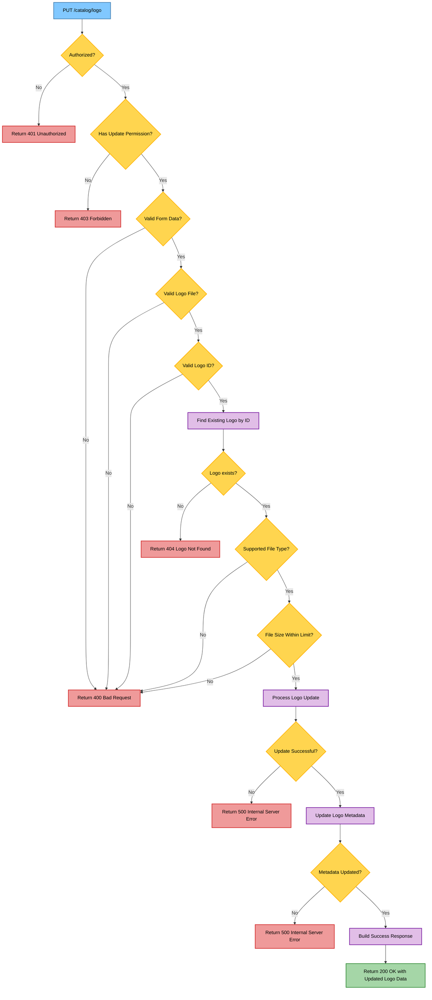
```mermaid
flowchart TD
%% API Flow: PUT /catalog/logo
Start[PUT /catalog/logo] --> Auth{Authorized?}
Auth -->|No| Auth401[Return 401 Unauthorized]
Auth -->|Yes| CheckPerms{Has Update Permission?}
CheckPerms -->|No| Forbidden403[Return 403 Forbidden]
CheckPerms -->|Yes| ValidateFormData{Valid Form Data?}
ValidateFormData -->|No| BadRequest400[Return 400 Bad Request]
ValidateFormData -->|Yes| ValidateFile{Valid Logo File?}
ValidateFile -->|No| BadRequest400
ValidateFile -->|Yes| ValidateId{Valid Logo ID?}
ValidateId -->|No| BadRequest400
ValidateId -->|Yes| FindLogo[Find Existing Logo by ID]
FindLogo --> LogoExists{Logo exists?}
LogoExists -->|No| NotFound404[Return 404 Logo Not Found]
LogoExists -->|Yes| CheckFileType{Supported File Type?}
CheckFileType -->|No| BadRequest400
CheckFileType -->|Yes| CheckFileSize{File Size Within Limit?}
CheckFileSize -->|No| BadRequest400
CheckFileSize -->|Yes| ProcessUpdate[Process Logo Update]
ProcessUpdate --> UpdateSuccess{Update Successful?}
UpdateSuccess -->|No| UpdateError500[Return 500 Internal Server Error]
UpdateSuccess -->|Yes| UpdateMetadata[Update Logo Metadata]
UpdateMetadata --> MetadataSuccess{Metadata Updated?}
MetadataSuccess -->|No| MetadataError500[Return 500 Internal Server Error]
MetadataSuccess -->|Yes| BuildResponse[Build Success Response]
BuildResponse --> Success200[Return 200 OK with Updated Logo Data]

classDef startEnd fill:#81C8FF,stroke:#4682B4,stroke-width:2px,color:#000;
classDef decision fill:#FFD54F,stroke:#FFB300,stroke-width:2px,color:#000;
classDef success fill:#A5D6A7,stroke:#388E3C,stroke-width:2px,color:#000;
classDef error fill:#EF9A9A,stroke:#D32F2F,stroke-width:2px,color:#000;
classDef process fill:#E1BEE7,stroke:#7B1FA2,stroke-width:2px,color:#000;

class Start,Success200 startEnd
class Auth,CheckPerms,ValidateFormData,ValidateFile,ValidateId,LogoExists,CheckFileType,CheckFileSize,UpdateSuccess,MetadataSuccess decision
class Success200 success
class Auth401,Forbidden403,BadRequest400,NotFound404,UpdateError500,MetadataError500 error
class FindLogo,ProcessUpdate,UpdateMetadata,BuildResponse process

```
</details>

---
| URL | Method | Auth Required | Description |
|-----|--------|---------------|-------------|
| `/catalog/logos` | GET | True | Retrieve a list of all uploaded logos |

> <details>
> <summary>Response body</summary>
>
> ```json
> {
>   "statusCode": 200,
>   "data": [
>     {
>       "_id": "image_id",
>       "user_id": "user_id",
>       "company_name": "COMPANY.png",
>       "company_uri": "https://company.com",
>       "image_size": 1024,
>       "is_deleted": false,
>       "updated_at": "timestamp"
>     }
>   ]
> }
> ```
>
> **Response:** `200 OK` - Logos retrieved successfully</br>
> **Response:** `401 Unauthorized` - Not authenticated</br>
> **Response:** `403 Forbidden` - Not authorized
> </details>
<detials>
<summary> Api flow diagram</summary>
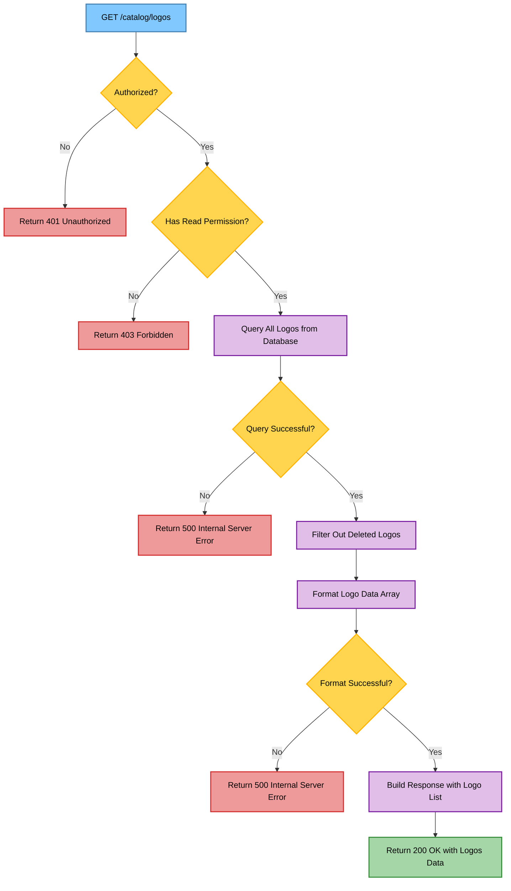
```mermaid
flowchart TD
%% API Flow: GET /catalog/logos
Start[GET /catalog/logos] --> Auth{Authorized?}
Auth -->|No| Auth401[Return 401 Unauthorized]
Auth -->|Yes| CheckPerms{Has Read Permission?}
CheckPerms -->|No| Forbidden403[Return 403 Forbidden]
CheckPerms -->|Yes| QueryLogos[Query All Logos from Database]
QueryLogos --> QuerySuccess{Query Successful?}
QuerySuccess -->|No| QueryError500[Return 500 Internal Server Error]
QuerySuccess -->|Yes| FilterDeleted[Filter Out Deleted Logos]
FilterDeleted --> FormatData[Format Logo Data Array]
FormatData --> FormatSuccess{Format Successful?}
FormatSuccess -->|No| FormatError500[Return 500 Internal Server Error]
FormatSuccess -->|Yes| BuildResponse[Build Response with Logo List]
BuildResponse --> Success200[Return 200 OK with Logos Data]

classDef startEnd fill:#81C8FF,stroke:#4682B4,stroke-width:2px,color:#000;
classDef decision fill:#FFD54F,stroke:#FFB300,stroke-width:2px,color:#000;
classDef success fill:#A5D6A7,stroke:#388E3C,stroke-width:2px,color:#000;
classDef error fill:#EF9A9A,stroke:#D32F2F,stroke-width:2px,color:#000;
classDef process fill:#E1BEE7,stroke:#7B1FA2,stroke-width:2px,color:#000;

class Start,Success200 startEnd
class Auth,CheckPerms,QuerySuccess,FormatSuccess decision
class Success200 success
class Auth401,Forbidden403,QueryError500,FormatError500 error
class QueryLogos,FilterDeleted,FormatData,BuildResponse process
```
</details>

</details>


<details>
<summary>OPERATOR</summary>

| URL | Method | Auth Required | Description |
|-----|--------|---------------|-------------|
| `/messages/:messageId` | PUT | True | Respond to a contact form message |

> <details>
> <summary>Request body</summary>
>
> ```json
> {
>   "reply": "This is a detailed response to the customer's inquiry."
> }
> ```
> </details>
>
> <details>
> <summary>Response body</summary>
>
> ```json
> {
>   "message": "Message updated successfully",
>   "data": {
>     "reply": "This is a detailed response to the customer's inquiry",
>     "activityStatus": true,
>     "assignedTo": "operator_id",
>     "email": "customer@example.com",
>     "message": "Original customer message"
>   }
> }
> ```
>
> **Response:** `200 OK` - Message updated successfully</br>
> **Response:** `400 Bad Request` - Invalid input data</br>
> **Response:** `401 Unauthorized` - Not authenticated</br>
> **Response:** `403 Forbidden` - Not authorized</br>
> **Response:** `404 Not Found` - Message not found
> </details>


<details>
<summary>Api Flow diagram</summary>

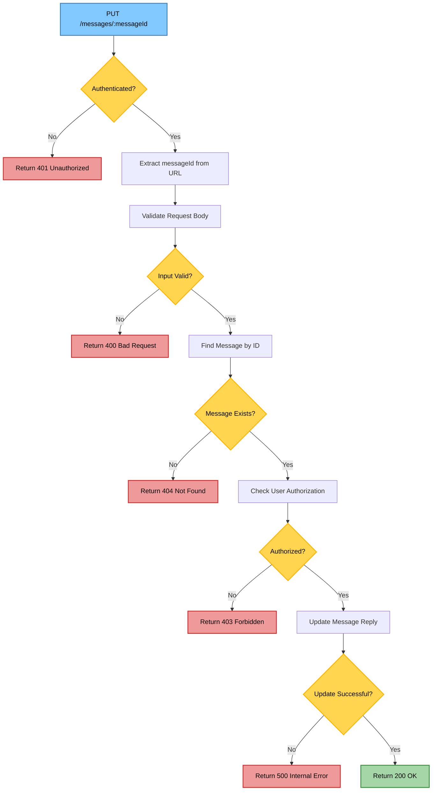
```mermaid
flowchart TD
%% API Flow: PUT /messages/:messageId
Start[PUT /messages/:messageId] --> Auth{Authenticated?}
Auth -->|No| Auth401[Return 401 Unauthorized]
Auth -->|Yes| ExtractId[Extract messageId from URL]
ExtractId --> ValidateBody[Validate Request Body]
ValidateBody --> InputValid{Input Valid?}
InputValid -->|No| Input400[Return 400 Bad Request]
InputValid -->|Yes| FindMessage[Find Message by ID]
FindMessage --> MessageExists{Message Exists?}
MessageExists -->|No| Message404[Return 404 Not Found]
MessageExists -->|Yes| CheckAuth[Check User Authorization]
CheckAuth --> Authorized{Authorized?}
Authorized -->|No| Auth403[Return 403 Forbidden]
Authorized -->|Yes| UpdateMessage[Update Message Reply]
UpdateMessage --> UpdateSuccess{Update Successful?}
UpdateSuccess -->|No| Update500[Return 500 Internal Error]
UpdateSuccess -->|Yes| Success200[Return 200 OK]

classDef startEnd fill:#81C8FF,stroke:#4682B4,stroke-width:2px,color:#000;
classDef decision fill:#FFD54F,stroke:#FFB300,stroke-width:2px,color:#000;
classDef success fill:#A5D6A7,stroke:#388E3C,stroke-width:2px,color:#000;
classDef error fill:#EF9A9A,stroke:#D32F2F,stroke-width:2px,color:#000;

class Start,Success200 startEnd
class Auth,InputValid,MessageExists,Authorized,UpdateSuccess decision
class Success200 success
class Auth401,Input400,Message404,Auth403,Update500 error
```
</details>

---
| URL | Method | Auth Required | Description |
|-----|--------|---------------|-------------|
| `/messages` | GET | True | Get messages received from contact form |

> <details>
> <summary>Query parameters</summary>
>
> - `page`: Page number for pagination (optional)
> - `limit`: Number of items per page (optional)
> </details>
>
> <details>
> <summary>Response body</summary>
>
> ```json
> {
>   "message": "Fetched all contact us messages.",
>   "statusCode": 200,
>   "total": 10,
>   "currentPage": 1,
>   "totalPages": 1,
>   "results": [
>     {
>       "_id": "message_id",
>       "email": "customer@example.com",
>       "name": "customer name",
>       "message": "Customer inquiry message",
>       "status": "PENDING",
>       "operator": "operator_id",
>       "is_deleted": false,
>       "updated_at": "timestamp",
>       "comment": "Operator's response"
>     }
>   ]
> }
> ```
>
> **Response:** `200 OK` - Messages retrieved successfully</br>
> **Response:** `400 Bad Request` - Invalid pagination parameters</br>
> **Response:** `401 Unauthorized` - Not authenticated</br>
> **Response:** `403 Forbidden` - Not authorized
> </details>

<details>
<summary>Api Flow diagram </summary>
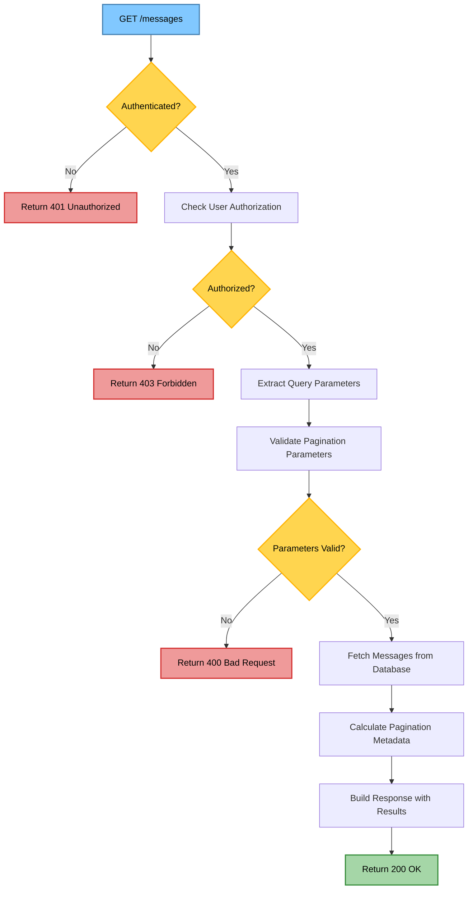
```mermaid
flowchart TD
%% API Flow: GET /messages
Start[GET /messages] --> Auth{Authenticated?}
Auth -->|No| Auth401[Return 401 Unauthorized]
Auth -->|Yes| CheckAuth[Check User Authorization]
CheckAuth --> Authorized{Authorized?}
Authorized -->|No| Auth403[Return 403 Forbidden]
Authorized -->|Yes| ExtractQuery[Extract Query Parameters]
ExtractQuery --> ValidateParams[Validate Pagination Parameters]
ValidateParams --> ParamsValid{Parameters Valid?}
ParamsValid -->|No| Params400[Return 400 Bad Request]
ParamsValid -->|Yes| FetchMessages[Fetch Messages from Database]
FetchMessages --> CalcPagination[Calculate Pagination Metadata]
CalcPagination --> BuildResponse[Build Response with Results]
BuildResponse --> Success200[Return 200 OK]

classDef startEnd fill:#81C8FF,stroke:#4682B4,stroke-width:2px,color:#000;
classDef decision fill:#FFD54F,stroke:#FFB300,stroke-width:2px,color:#000;
classDef success fill:#A5D6A7,stroke:#388E3C,stroke-width:2px,color:#000;
classDef error fill:#EF9A9A,stroke:#D32F2F,stroke-width:2px,color:#000;

class Start,Success200 startEnd
class Auth,Authorized,ParamsValid decision
class Success200 success
class Auth401,Auth403,Params400 error
```
</details>

---
| URL | Method | Auth Required | Description |
|-----|--------|---------------|-------------|
| `/messages/contact-us` | POST | False | Submit a new contact form message |

> <details>
> <summary>Request body</summary>
>
> ```json
> {
>   "name": "customer name",
>   "email": "customer@example.com",
>   "message": "This is a detailed message from the customer."
> }
> ```
> </details>
>
> <details>
> <summary>Response body</summary>
>
> ```json
> {
>   "message": "Form submitted, our team will get in touch shortly",
>   "statusCode": 200
> }
> ```
>
> **Response:** `200 OK` - Message submitted successfully</br>
> **Response:** `400 Bad Request` - Invalid input data
> </details>

<details>
<summary>Api Flow diagram </summary>
```mermaid
---
config:
  theme: neo-dark
  look: classic
  layout: dagre
---
flowchart TD
%% API Flow: POST /messages/contact-us
Start[POST /messages/contact-us] --> ExtractBody[Extract Request Body]
ExtractBody --> ValidateInput[Validate Input Data]
ValidateInput --> InputValid{Input Valid?}
InputValid -->|No| Input400[Return 400 Bad Request]
InputValid -->|Yes| SaveMessage[Save Message to Database]
SaveMessage --> SaveSuccess{Save Successful?}
SaveSuccess -->|No| Save500[Return 500 Internal Server Error]
SaveSuccess -->|Yes| Success200[Return 200 OK]

classDef startEnd fill:#81C8FF,stroke:#4682B4,stroke-width:2px,color:#000;
classDef decision fill:#FFD54F,stroke:#FFB300,stroke-width:2px,color:#000;
classDef success fill:#A5D6A7,stroke:#388E3C,stroke-width:2px,color:#000;
classDef error fill:#EF9A9A,stroke:#D32F2F,stroke-width:2px,color:#000;

class Start,Success200 startEnd
class InputValid,SaveSuccess decision
class Success200 success
class Input400,Save500 error
```

</details>


<details>
<summary>BUSINESS API</summary>

| URL | Method | Auth Required | Description |
|-----|--------|---------------|-------------|
| `/logo` | GET | False | Get single image |

> <details>
> <summary>Query parameters</summary>
>
> - `domain`: The domain name of the company (required)
> - `API_KEY`: API key for authentication (required)
> </details>
>
> <details>
> <summary>Response body</summary>
>
> ```json
> {
>   "statusCode" : 200,
>   "data": "https://api.example.com/logos/company-logo.png"
> }
> ```
>
> **Response:** `200 OK` - Logo retrieved successfully</br>
> **Response:** `400 Bad Request` - Invalid input parameters</br>
> **Response:** `401 Unauthorized` - Invalid API key</br>
> **Response:** `404 Not Found` - Logo not found
> </details>
<details>
<summary>Api Flow diagram</summary>
```mermaid
---
config:
  theme: neo-dark
  look: classic
  layout: dagre
---
flowchart TD
%% API Flow: GET /logo
Start[GET /logo] --> ExtractQuery[Extract Query Parameters]
ExtractQuery --> ValidateParams[Validate Input Parameters]
ValidateParams --> ParamsValid{Parameters Valid?}
ParamsValid -->|No| Params400[Return 400 Bad Request]
ParamsValid -->|Yes| ValidateKey[Validate API Key]
ValidateKey --> KeyValid{API Key Valid?}
KeyValid -->|No| Key401[Return 401 Unauthorized]
KeyValid -->|Yes| SearchLogo[Search Logo by Domain]
SearchLogo --> LogoFound{Logo Found?}
LogoFound -->|No| Logo404[Return 404 Not Found]
LogoFound -->|Yes| ReturnUrl[Return Logo URL]
ReturnUrl --> Success200[Return 200 OK]

classDef startEnd fill:#81C8FF,stroke:#4682B4,stroke-width:2px,color:#000;
classDef decision fill:#FFD54F,stroke:#FFB300,stroke-width:2px,color:#000;
classDef success fill:#A5D6A7,stroke:#388E3C,stroke-width:2px,color:#000;
classDef error fill:#EF9A9A,stroke:#D32F2F,stroke-width:2px,color:#000;

class Start,Success200 startEnd
class ParamsValid,KeyValid,LogoFound decision
class Success200 success
class Params400,Key401,Logo404 error


```
</details>

---
| URL | Method | Auth Required | Description |
|-----|--------|---------------|-------------|
| `/logo/search` | GET | False | Get multiple images |

> <details>
> <summary>Query parameters</summary>
>
> - `domainKey`: Prefix of the domain name to filter logos (required)
> - `API_KEY`: API key for authentication (required)
> </details>
>
> <details>
> <summary>Response body</summary>
>
> ```json
> {
>   "statusCode" : 200,
>   "data": [
>       {
>        "companyName" : "companyName",
>        "image" : "https://api.example.com/logos/company-logo.png"
>       }
>    ]
> }
> ```
>
> **Response:** `200 OK` - Logos retrieved successfully</br>
> **Response:** `400 Bad Request` - Invalid input parameters</br>
> **Response:** `401 Unauthorized` - Invalid API key
> </details>
<details>
<summary>Api Flow diagram</summary>
```mermaid
flowchart TD
%% API Flow: GET /logo/search
Start[GET /logo/search] --> ExtractParams[Extract Query Parameters]

ExtractParams --> ValidateParams[Validate Input Parameters]
ValidateParams --> ParamsValid{Parameters Valid?}

ParamsValid -->|No| BadRequest400[Return 400 Bad Request]
ParamsValid -->|Yes| ValidateAPIKey[Validate API Key]

ValidateAPIKey --> APIKeyValid{API Key Valid?}
APIKeyValid -->|No| Auth401[Return 401 Unauthorized]
APIKeyValid -->|Yes| SearchLogos[Search Logos by Domain Prefix]

SearchLogos --> BuildResponse[Build Response Array]
BuildResponse --> Success200[Return 200 OK]

classDef startEnd fill:#81C8FF,stroke:#4682B4,stroke-width:2px,color:#000;
classDef decision fill:#FFD54F,stroke:#FFB300,stroke-width:2px,color:#000;
classDef success fill:#A5D6A7,stroke:#388E3C,stroke-width:2px,color:#000;
classDef error fill:#EF9A9A,stroke:#D32F2F,stroke-width:2px,color:#000;

class Start,Success200 startEnd
class ParamsValid,APIKeyValid decision
class Auth401,BadRequest400 error
class Success200 success
```
</details>

---
| URL | Method | Auth Required | Description |
|-----|--------|---------------|-------------|
| `/logo/demo-search` | GET | False | Demo search endpoint (no auth required) |

> <details>
> <summary>Query parameters</summary>
>
> - `domainKey`: Prefix of the domain name to filter logos (required)
> </details>
>
> <details>
> <summary>Response body</summary>
>
> ```json
> {
>   "statusCode" : 200,
>   "data": [
>       {
>        "companyName" : "companyName",
>        "image" : "https://api.example.com/logos/company-logo.png"
>       }
>    ]
> }
> ```
>
> **Response:** `200 OK` - Logos retrieved successfully</br>
> **Response:** `400 Bad Request` - Invalid input parameters
> </details>
<detials>
<summary>Api Flow diagram</summary>
```mermaid
flowchart TD
%% API Flow: GET /logo/demo-search
Start[GET /logo/demo-search] --> ExtractParams[Extract Query Parameters]

ExtractParams --> ValidateParams[Validate Input Parameters]
ValidateParams --> ParamsValid{domainKey Provided?}

ParamsValid -->|No| BadRequest400[Return 400 Bad Request]
ParamsValid -->|Yes| SearchLogos[Search Logos by Domain Prefix]

SearchLogos --> BuildResponse[Build Response Array]
BuildResponse --> Success200[Return 200 OK]

classDef startEnd fill:#81C8FF,stroke:#4682B4,stroke-width:2px,color:#000;
classDef decision fill:#FFD54F,stroke:#FFB300,stroke-width:2px,color:#000;
classDef success fill:#A5D6A7,stroke:#388E3C,stroke-width:2px,color:#000;
classDef error fill:#EF9A9A,stroke:#D32F2F,stroke-width:2px,color:#000;

class Start,Success200 startEnd
class ParamsValid decision
class BadRequest400 error
class Success200 success


```
</details>

</details>
