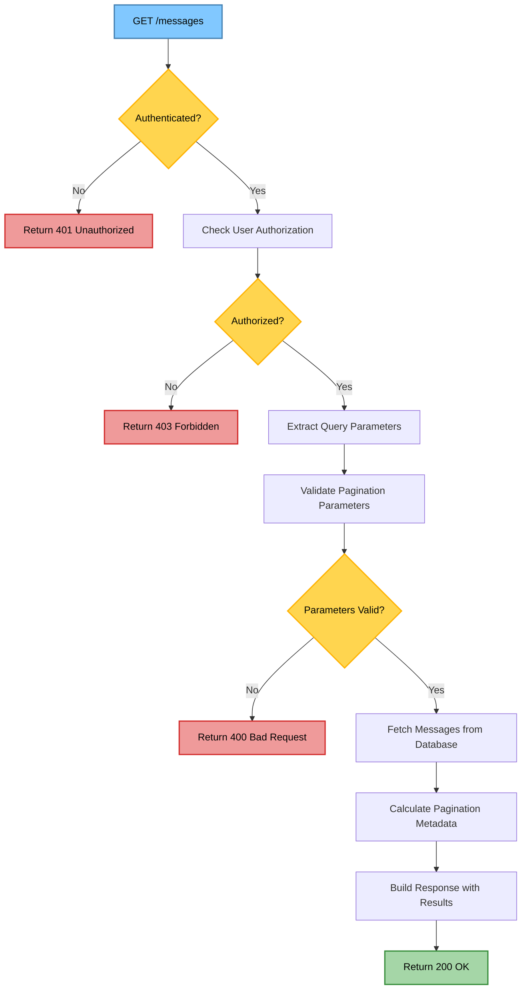
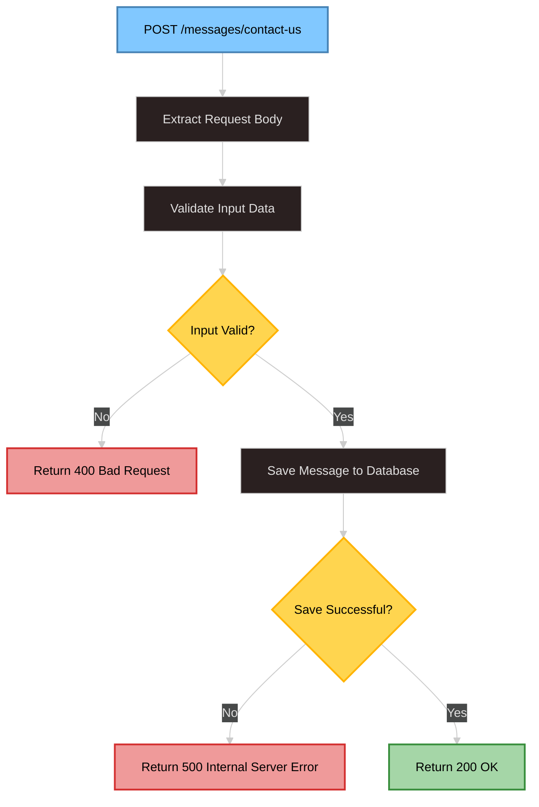

### API FLOW 1
<detail>

</detail>

### API FLOW 2

```mermaid
flowchart TD
%% API Flow: GET /messages
Start[GET /messages] --> Auth{Authenticated?}
Auth -->|No| Auth401[Return 401 Unauthorized]
Auth -->|Yes| CheckAuth[Check User Authorization]
CheckAuth --> Authorized{Authorized?}
Authorized -->|No| Auth403[Return 403 Forbidden]
Authorized -->|Yes| ExtractQuery[Extract Query Parameters]
ExtractQuery --> ValidateParams[Validate Pagination Parameters]
ValidateParams --> ParamsValid{Parameters Valid?}
ParamsValid -->|No| Params400[Return 400 Bad Request]
ParamsValid -->|Yes| FetchMessages[Fetch Messages from Database]
FetchMessages --> CalcPagination[Calculate Pagination Metadata]
CalcPagination --> BuildResponse[Build Response with Results]
BuildResponse --> Success200[Return 200 OK]

classDef startEnd fill:#81C8FF,stroke:#4682B4,stroke-width:2px,color:#000;
classDef decision fill:#FFD54F,stroke:#FFB300,stroke-width:2px,color:#000;
classDef success fill:#A5D6A7,stroke:#388E3C,stroke-width:2px,color:#000;
classDef error fill:#EF9A9A,stroke:#D32F2F,stroke-width:2px,color:#000;

class Start,Success200 startEnd
class Auth,Authorized,ParamsValid decision
class Success200 success
class Auth401,Auth403,Params400 error
```

### API FLOW 3

```mermaid
---
config:
  theme: neo-dark
  look: classic
  layout: dagre
---
flowchart TD
%% API Flow: POST /messages/contact-us
Start[POST /messages/contact-us] --> ExtractBody[Extract Request Body]
ExtractBody --> ValidateInput[Validate Input Data]
ValidateInput --> InputValid{Input Valid?}
InputValid -->|No| Input400[Return 400 Bad Request]
InputValid -->|Yes| SaveMessage[Save Message to Database]
SaveMessage --> SaveSuccess{Save Successful?}
SaveSuccess -->|No| Save500[Return 500 Internal Server Error]
SaveSuccess -->|Yes| Success200[Return 200 OK]

classDef startEnd fill:#81C8FF,stroke:#4682B4,stroke-width:2px,color:#000;
classDef decision fill:#FFD54F,stroke:#FFB300,stroke-width:2px,color:#000;
classDef success fill:#A5D6A7,stroke:#388E3C,stroke-width:2px,color:#000;
classDef error fill:#EF9A9A,stroke:#D32F2F,stroke-width:2px,color:#000;

class Start,Success200 startEnd
class InputValid,SaveSuccess decision
class Success200 success
class Input400,Save500 error
```