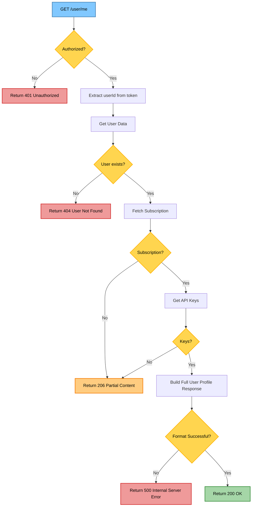

<details>
<summary>USER</summary>

| URL | Method | Auth Required | Description |
|-----|--------|---------------|-------------|
| `/user/me` | GET | True | Retrieve authenticated user profile |

> <details>
> <summary>Response body</summary>
>
> ```json
> {
>    "statusCode": 200,
>    "data": {
>        "name": "ahrak nivah",
>        "email": "enyyvish@gmail.com",
>        "role": "CUSTOMER",
>        "is_verified": true,
>        "subscription_id": "6826d68a0fbea0d79998ef43",
>        "userId": "6826d68a0fbea0d79998ef45",
>        "created_at": "2025-05-16T06:09:14.000Z",
>        "is_deleted": false,
>        "updated_at": "2025-05-16T06:09:14.513Z",
>        "subscription": {
>            "_id": "6826d68a0fbea0d79998ef43",
>            "type": "HOBBY",
>            "key_limit": 2,
>            "usage_limit": 500,
>            "usage_count": 0,
>            "is_active": true,
>            "updated_at": "2025-05-16T06:09:14.288Z"
>        },
>        "keys": []
>    }
>}
> ```
>
> **Response:** `200 OK` - User profile retrieved successfully</br>
> **Response:** `401 Unauthorized` - Not authenticated</br>
> **Response:** `404 Not Found` - User not found
> </details>

<details>
<summary>Api Flow diagram</summary>


</details>